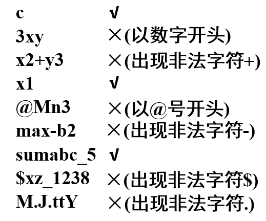

变量、常量和数据类型
--------------------

标识符：字母、数字、下划线构成

​			开头——必须是字母或下划线

​			大小写敏感

​			不能和关键词相同

### 数据类型

#### 

#### 整型

​	

​	十进制          22

​	八进制          026——0开头，数字不能有8

​	十六进制       0x16       abcdef

​	科学计数法   12.5e-6    8.5E3   ——e两边都得有数，右边不能是小数

​	int 整型 2、4字节

​	short 短整型 2字节

​	long 长整型 4字节

#### 浮点型

​	float 浮点数 4个字节

​	double 双精度浮点数 8个字节

#### ASCII码

‘0’  —— 48

‘9’  —— 57

‘A’ —— 65

‘a’ —— 97

#### 转义字符

\t    \n   