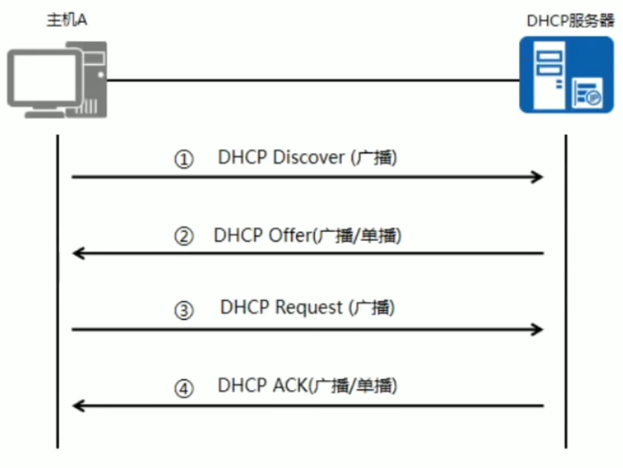
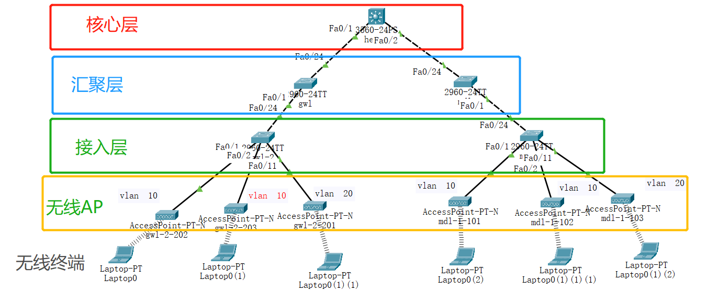
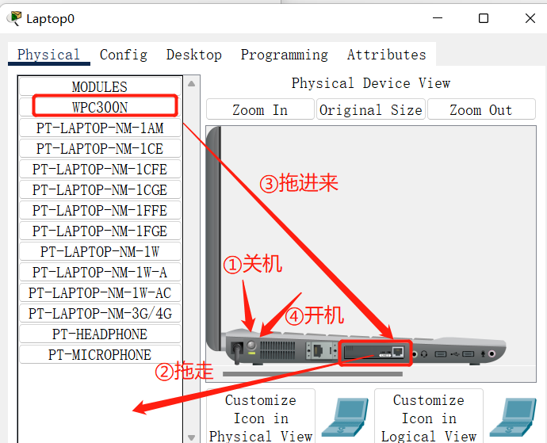
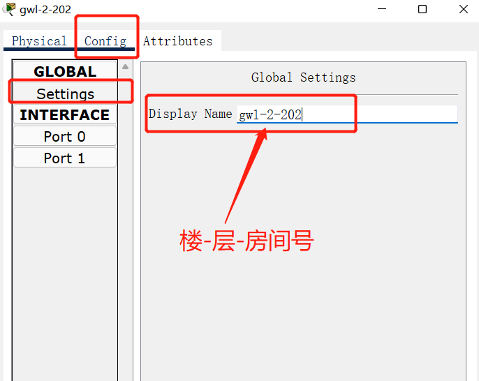
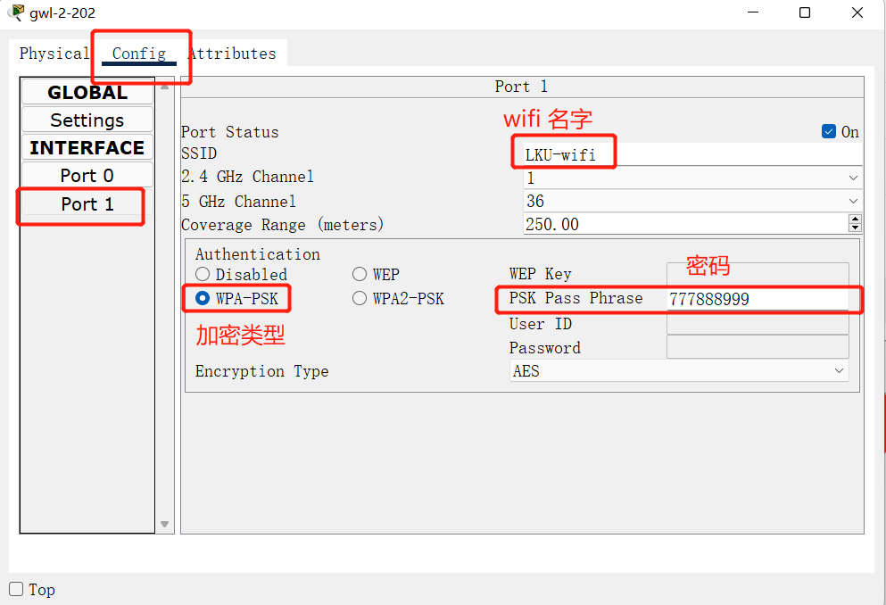
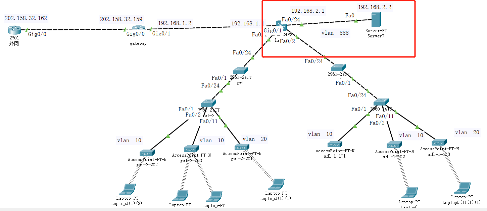
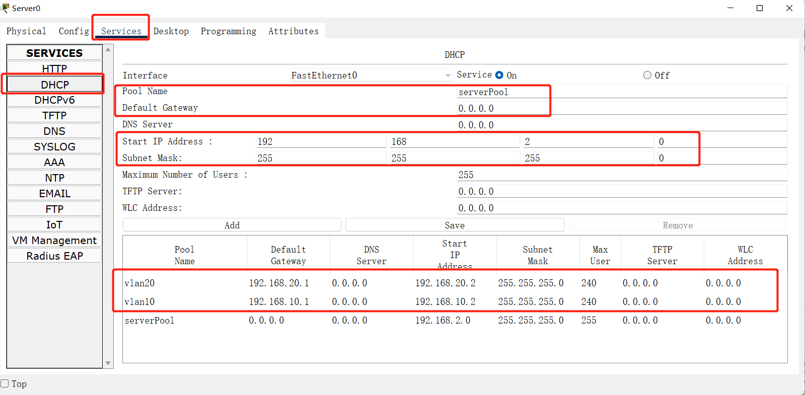
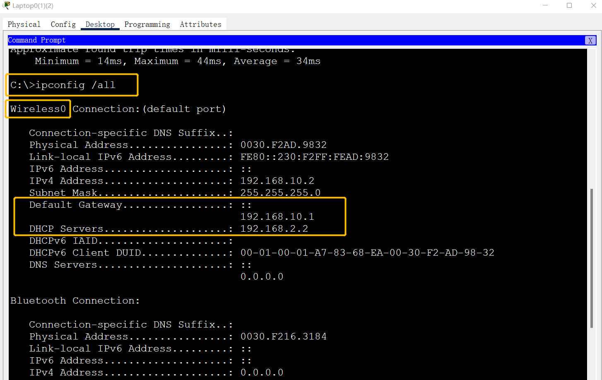

1-DHCP
====

*DHCP*(Dynamic Host Configuration Protocol,动态主机配置协议)，是一个应用层协议。当我们客户主机IP地址设置为动态获取方式时，DHCP服务器就会根据DHCP协议给客户端分配IP，使客户机能够使用这个IP上网。

当局域网中存在大量主机时，手动配置IP工作量巨大，容易导致IP冲突等错误。



### 拓扑图




### 无线终端配置




### 无线AP配置

#### 	修改AP名称



#### 	设置wifi信息




### 接入层配置

```python
#新建两个VLAN,VLAN 10 和 VLAN 20
Switch>en 
Switch#conf t
Switch(config)#hostname gwl-2       修改交换机名字
gwl-2(config)#vlan 10
gwl-2(config-vlan)#vlan 20
gwl-2(config-vlan)#exit
```

```python
#将下连1-10口设置为access并分配给vlan 10 ，  11-20口设置为access并分配给vlan 20 
gwl-2(config)#interface range fastEthernet 0/1-10
gwl-2(config-if-range)#switchport mode access
gwl-2(config-if-range)#switchport access vlan 10
gwl-2(config-if-range)#exit
gwl-2(config)#interface range fastEthernet 0/11-20
gwl-2(config-if-range)#switchport mode access
gwl-2(config-if-range)#switchport access vlan 20
gwl-2(config-if-range)#exit
```

```python
#将上连24口设置为trunk类型
gwl-2(config)#interface fastEthernet 0/24
gwl-2(config-if)#switchport mode trunk
gwl-2(config-if)#exit
```


### 汇聚层配置

```python
Switch>en 
Switch#conf t
Switch(config)#hostname gwl
gwl(config)#vlan 10
gwl(config-vlan)#vlan 20
gwl(config-vlan)#exit
```

```python
#将下连1-10口、上连24口，设置为trunk类型
gwl(config)#interface range f0/1-10 
gwl(config-if-range)#switchport mode trunk 
gwl(config-if-range)#exit
gwl(config)#interface f0/24
gwl(config-if)#switchport mode trunk 
gwl(config-if)#exit
```


### 核心层配置

#### 	VLAN配置

```python
Switch>en 
Switch#conf t
Switch(config)#hostname hexin
hexin(config)#vlan 10
hexin(config-vlan)#vlan 20
hexin(config-vlan)#exit
```

```python
#给两个vlan 分别配置IP地址
hexin(config)#int vlan 10
hexin(config-if)#ip add 192.168.10.1 255.255.255.0
hexin(config-if)#exit
hexin(config)#inter vlan 20
hexin(config-if)#ip add 192.168.20.1 255.255.255.0
hexin(config-if)#exit
```

```python
#3560交换机，如果下层设备端口为trunk，3560会自动把对应端口也设置为trunk
#这里可以不用配置，如果没有自动配置，则可以手动运行
hexin(config)#int f0/1
hexin(config-if)#switchport mode trunk 
hexin(config-if)#exit
```


#### DHCP配置

```python
#建立两个DHCP地址池，并配置地址段和默认路由
hexin(config)#service dhcp 
hexin(config)#ip dhcp pool vlan10
hexin(dhcp-config)#network 192.168.10.0 255.255.255.0
hexin(dhcp-config)#default-router 192.168.10.1
hexin(config)#ip dhcp pool vlan20
hexin(dhcp-config)#network 192.168.20.0 255.255.255.0
hexin(dhcp-config)#default-router 192.168.20.1
```

```python
#开启路由功能
hexin(config)#ip routing
```

### 检测连通性

​	使用3台笔记本电脑，分别连接三个无线AP，互相PING

​	复制并扩展网络


2-出口网关
========

### 	拓扑图


### 	核心交换机

```python
#配置上联g0/1口的IP地址
hexin(config)#interface g0/1
hexin(config-if)#no switchport 
hexin(config-if)#ip add 192.168.1.1 255.255.255.0
hexin(config-if)#no shutdown 
hexin(config-if)#exit
#配置RIP
hexin(config)#router rip
hexin(config-router)#version 2
hexin(config-router)#network 192.168.10.0
hexin(config-router)#network 192.168.20.0
hexin(config-router)#network 192.168.1.0
hexin(config-router)#exit
```

### 	出口网关

```python
Router>enable
Router#configure terminal
Router(config)#hostname gateway

#配置内口IP地址
gateway(config)#interface g0/1
gateway(config-if)#ip add 192.168.1.2 255.255.255.0
gateway(config-if)#no shutdown
gateway(config-if)#exit
#配置外口IP地址
gateway(config)#interface g0/0
gateway(config-if)#ip add 202.158.32.159 255.255.255.0
gateway(config-if)#no shutdown
gateway(config-if)#exit

#配置RIP
gateway(config)#router rip 
gateway(config-router)#version 2
gateway(config-router)#network 192.168.1.0
gateway(config-router)#network 202.158.32.0
gateway(config-router)#exit
```

### 	外部路由器

```python
Router>enable
Router#configure terminal
Router(config)#hostname Outer

#配置连接内网的端口IP
Outer(config)#int g0/0
Outer(config-if)#ip add 202.158.32.162 255.255.255.0
Outer(config-if)#no shutdown 
Outer(config-if)#exit

#配置RIP协议
Outer(config)#router rip 
Outer(config-router)#version 2
Outer(config-router)#network 202.158.32.0
```


3-DHCP中继
==========

### 拓扑图



### 核心

```python
#在核心交换机关闭地址池
hexin(config)#no ip dhcp pool vlan10
hexin(config)#no ip dhcp pool vlan20

#新建一个VLAN 连接DHCP服务器
hexin(config)#vlan 888
hexin(config-vlan)#exit
hexin(config)#int f0/24
hexin(config-if)#switchport mode access 
hexin(config-if)#switchport access vlan 888
hexin(config)#interface vlan 888
hexin(config-if)#ip add 192.168.2.1 255.255.255.0

#开启DHCP中继
hexin(config)#int vlan 10 
hexin(config-if)#ip helper-address 192.168.2.2 
hexin(config-if)#exit
hexin(config)#int vlan 20 
hexin(config-if)#ip helper-address 192.168.2.2 
hexin(config-if)#exit
```


### DHCP服务器

​	#服务器IP地址、子网掩码、网关配置，类似PC

​	#DHCP服务器配置




### 检测

在PC端使用 ipconfig /all  命令

