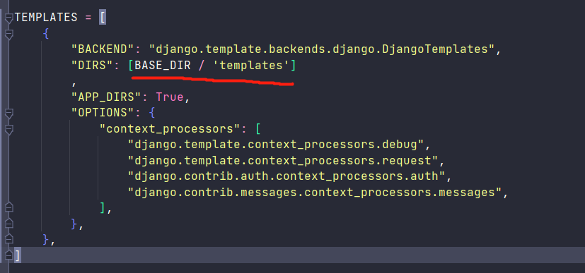
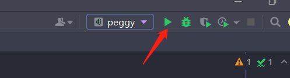
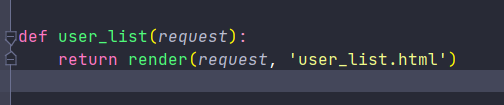
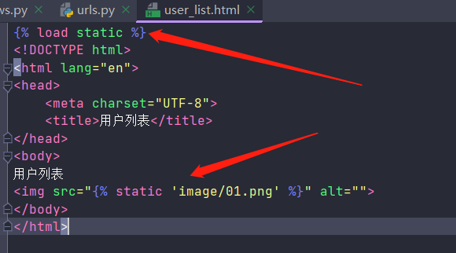

安装django
======

## 安装Django

```python
pip install django
```

## 创建项目

### 第一种

进入需要创建项目的目录，cmd

```
django-admin startproject 项目名
```

### 第二种

pycharm 专业版中新建django项目

通过Pycharm创建的项目，多了一个templates目录（可以删除）

同时这里删除



## 项目目录

```
peggy
|-peggy
    |-__init__.py
    |-asgi.py   			【接收网络请求，异步】
    |-settings.py			【项目配置文件】
    |-urls.py				【路由】
    |-wsgi.py				【接收网络请求，同步式】
|-manage.py    				【项目的管理、启动项目、创建app、数据管理】
```

创建APP
-------

```
# 终端
python manage.py startapp app名字
```

- app目录

```python
app01
    |-migrations			【model使用，固定不用动】
        |-__init__.py
    |-__init__.py
    |-admin.py				【后台管理，固定不动】
    |-apps.py
    |-models.py				【*数据库】
    |-tests.py				【单元测试，固定不动】
    |-views.py				【*视图函数】
```

- 注册->setting中注册


```
app01.apps.App01Config
```

- urls中，编写url和视图函数对应关系


```python
import app01
path("index/", app01.views.index),
```

启动服务器
----------

### 4.1 命令行

```
python managy.py runserver
```

### 4.2 pycharm



templates和静态文件
-------------------



会在app目录下寻找templates找对应页面


### 静态文件

- 图片、js文件、css、plugins等是静态文件

- 在app下新建templates目录，然后templates下建立js css image等目录存放静态文件

- 模板中引入静态文件



数据库安装
----------

### Mysql安装

```python
pip install mysqlclient
```

### Mysql配置

```python
# setting.py中设置
DATABASES = {
    "default": {
        "ENGINE": "django.db.backends.mysql",
        "NAME": 'peppa',  # 数据库名
        'USER': 'root',
        'PASSWORD': '123456',
        'HOST': '127.0.0.1',  # ip
        'PORT': 3306  # 端口号
    }
}
```

跨域解决
--------

```python
# 安装
pip install 
```

setting.py文件中

```python
# app中注册
INSTALLED_APPS = [  
     ...  
     'corsheaders', 
     ...  ]  

 MIDDLEWARE_CLASSES = ( 
     ...  
     #尽可能靠前，必须在CsrfViewMiddleware、CommonMiddleware之前。
     #我们直接放在第一个位置就好了
     'django.middleware.csrf.CsrfViewMiddleware',
     'corsheaders.middleware.CorsMiddleware',  # 加入这个中间件
     'django.middleware.common.CommonMiddleware', 
     ... 
 ) 
# 添加参数为true
CORS_ORIGIN_ALLOW_ALL = True

# 至此，亦可以跨域访问，下面这些可以选择性设置
# 跨域增加忽略 
CORS_ALLOW_CREDENTIALS = True
# 设置白名单
CORS_ORIGIN_WHITELIST = ('*')   
# 允许访问的方法
CORS_ALLOW_METHODS = ('DELETE',  'GET',  'OPTIONS',  'PATCH',  'POST',  'PUT',  'VIEW',)
# 允许访问的头部字段
CORS_ALLOW_HEADERS = (  
    'XMLHttpRequest',  
    'X_FILENAME',  
    'accept-encoding', 
    'authorization',  
    'content-type',  
    'dnt',
    'origin',  
    'user-agent',  
    'x-csrftoken',  
    'x-requested-with',  
    'Pragma',
) 
```


MTV-Templates
=============

## 基本语法

```python
# 在模板中，
{{ name }}
# 列表
{{ name.0 }}  {{ name.1 }}
# 字典
{{ name.name }}  {{ name.age }} {{ name.sex }}
```

## 遍历

```python
# 字典



<div>{{item.}}</div>

# 字典.键

# 字典.值

```

```python







```

CSRF验证
--------

### form表单中

```
  # 加入
```

模板继承
--------

母版中

```python
 
	html代码   

```

其他页面中

```python


# 其他html代码

```

母版中可以定义多个block，子页面中可以写多个content

MTV-Views
=========

引入
----------

```python
#引入
from django.shortcuts import render, HttpResponse  #render模板渲染，HttpResponse HTTP响应
from django.http.response import JsonResponse  # 响应Json格式数据
```

请求和响应
----------

```python
# 获取请求方式
print(request.method)
# 获取url中的参数
print(request.GET)
# 获取请求体中的参数
print(request.POST) 
```

```python
from django.shortcuts import render, HttpResponse
# 数据返回请求
return HttpResponse('返回')
# 模板渲染
return render(request, '模板', {数据})
```

```python
# 重定向
from django.shortcuts import render,HttpResponse,redirect,HttpResponseRedirect

# 第一种
from django.urls import reverse
url = reverse('index')  # 路由name的值
return HttpResponseRedirect(url)

# 第二种
return HttpResponseRedirect('app02/index')  # 路由path中的路由

# 第三种
return redirect('app02/index')
return redirect('https://www.baidu.com')
```

```python
# 返回json类型数据
from django.http.response import JsonResponse
return JsonResponse(data)  # data必须是字典
```


## 增删改查CRUD

### 增

```python
# 新增一条数据
UserInfo.objects.create(
            username=username,
            password=password,
            size=size,
            age=age)

# 第二种
from blog.models import Blog
b = Blog(name='Beatles Blog', tagline='All the latest Beatles news.')
b.save()
```

### 删

```python
# 删除一条数据
UserInfo.objects.filter(id=id).delete()
```

### 改

```python
# 更新一条数据
UserInfo.objects.filter(id=id).update(name='')
```

### 查

```python
# 查询全部
data = UserInfo.objects.all()
# 查询一条
data = UserInfo.objects.get(pk=1)
first()  # 返回第一个
last()  # 返回最后一个
count()  # 返回查询集的对象个数
exists()  # 判断查询集是否有数据
```

#### 过滤器和查询条件

```
# filter 返回符合筛选条件的数据
__gt大于
__lt小于
__gte大于等于
__lte小于等于
__in在..里
# 前面加i，忽略大小写
__contains 包含
__startswith
__endwith
# exclude 返回不符合筛选条件的数据
```

**filter和exclude可以链式调用**


MTV-Model
=====

## 创建表

```python
# 项目中model.py
# 创建一张表app01_userinfo,自动生成id列（主键）
class UserInfo(models.Model):
    name = models.CharField(max_length=32)
    password = models.CharField(max_length=64)
    age = models.IntegerField()
```

```python
# 命令行
python manage.py makemigrations app名字
python manage.py migrate app名字
```


## 已有表中新增字段

### 第一种

```python
# 命令行
python manage.py makemigrations
# 1-输入一个默认值  2-退出
python manage.py migrate
```

### 第二种

```python
# 给字段设置默认值
size = models.IntegerField(default=170)

# 命令行
python manage.py makemigrations
python manage.py migrate
```

### 第三种

```python
# 设置字段值可以为空
size = models.IntegerField(null=True, blank=True)

# 命令行
python manage.py makemigrations
python manage.py migrate
```


字段类型
--------

### 文本类型

```python
# 根据实际ID自动增长的IntegerField,通常不指定。
# 如果不指定，一个主键（id）自动加到模型中
models.AutoField()
# 字符串，默认表单样式是textinput
models.CharField(max_length=字符长度)
# 大文本，一般超过4000使用，默认表单控件是textarea
models.TextField()
```

### 数字类型

```python
# 整数
models.IntegerField()
# 十进制浮点数，参数max_digits数字总长度，decimal_places小数长度
models.DecimalField(max_digits=10,decimal_places=2)
# 浮点数
models.FloatField()
```

### boolean类型

```python
# 布尔类型，true/false，默认表单控件是checkboxinput
models.BooleanField()
```

### 时间和日期

```python
# 日期，参数：
# auto_now=true/false 每次保存对象时
# auto_now_add=true/false 对象被创建时
models.DateField()
# 日期+时间，python中datetime.datetime实例表示的时间和日期
models.DateTimeField()
# 时间，python中datetime.time实例表示的时间和日期
models.TimeField()
```

### 文件类型

```python
# 文件上传
models.FileField()
# 图片上传，继承FileField（）同时校验了图片有效性
models.ImageField()
```


字段选项
--------

通过字段选项，实现对字段的约束。

```python
verbose_name = ''  # 
```

```python
default=''  # 设置字段默认值
```

```python
help_text  # 额外的“帮助”文本，随表单控件一同显示
```

```python
validators  # 要为该字段运行的验证器列表
```


```python
null
# True/False，允许以 NULL 存入数据库中，默认False
```

```python
black
# True/False，允许字段为 空白，默认False
```

**null是数据库范围的概念，blank是表单验证范围的概念**

```python
choices = [(A，B)，(A，B)...]
# 每个元组中的第一个元素是要在模型上设置的实际值，第二个元素是人可读的名称
```


```python
db_column  # 设置字段名称，如果为指定，使用属性名称
```

```python
db_index  # 如果为True，以此字段创建索引
# 一般针对外键、经常查询的字段加索引
```

```python
primary_key  # 若为True，该字段成为主键
```

```python
unique  # 若为True，该字段在表中是唯一值
```


关系
----

```
 models.ForeignKey()  # 外键
 models.ManyToManyField()
 models.OneToOneField()
```

元选项
------

在model类中定义Meta，用于设置元信息

```python
    class Meta:
        # 指定app的标签，一般不用
        app_label = 'app02'
        # 修改数据表名字。django默认表名是app_label + '_' + db_table
        db_table = '表名'

        ordering = ['order_date']
        # 按订单升序排列
        ordering = ['-order_date']
        # 按订单降序排列，-表示降序
        ordering = ['?order_date']
        # 随机排序，？表示随机
        ordering = ['-pub_date', 'author']
        # 对 pub_date 降序,然后对 author 升序
```

```python
def __str__(self):
        return self.name  #类的返回值
```

URL
===

开发者应该为每个不同的APP设计单独的URL

```python
from django.contrib import admin
from django.urls import path, include, re_path

# re_path可以根据正则表达式匹配
# include('app名.urls')
urlpatterns = [
	...
    path('app02/', include('app02.urls')),
    path('news/<int:news_id>/', views.news),
    re_path(r'^api/student/?', include('app01.urls'))
	...
]

# 在app中，新建url.py文件
from django.urls import path,include
from app02 import views
# FBV函数视图：直接指向对应的函数
# CBV类视图：....
urlpatterns = [
    path('', views.clazz_name),
    path('index', views.index, name='index'),
    path('news', views.news, name='news'),
]
```

路径转换
--------

在模式字符串中加入<<类型:变量名>>

```python
path('news/<int:news_id>/', views.news, name='news'),

# 可选类型：
# str——字符串(不能包含 '/' 路径分隔符)
# path——字符串(包含 '/' 路径分隔符)
# int——非负整数
# slug
# uuid
```

URL反转
-------

```html
在模板中使用视图的url
<a href=""></a>
模板会把其替换为 /news/10001/ 这样
```

```python
在视图中使用当前视图的url
url = reverse('news', args=(news.id,))
```


会话
====

Cookie
------

- 客户端会话技术，数据存储在客户端

- 键值对存储

- 支持过期时间

- 默认Cookie会自动携带

- Cookie不能跨域名

- 通过HttpResponse

- ```python
	# 登录页面视图
	def login(request):
	    if request.method=='GET':
	        return render(request, 'login.html')
	    if request.POST.get('uname')=='111' and request.POST.get('pwd')=='456':
	        response = redirect('index')
	        response.set_signed_cookie('uname', '111', salt='abcd', max_age=300)
	        return response
	    return HttpResponse('登录失败')
	
	# 首页视图
	def index(request):
	    uname = request.get_signed_cookie('uname', salt='abcd', default='用户名错误')
	    if uname:
	        return HttpResponse('成功'+uname)
	    return redirect('login')
	
	# 登出视图
	def logout(request):
	    response = redirect('login')
	    response.delete_cookie('uname')
	    return response
	```

	```python
	# set_cookie函数参数
	def set_cookie(self,
	               key: Any,  # 键
	               value: str = '',  # 值
	               max_age: Any = None,
	               expires: Any = None,
	               path: str = '/',
	               domain: Any = None,
	               secure: bool = False,
	               httponly: bool = False,
	               samesite: Any = None) -> Any
	```


Session
-------

- 服务端会话技术
- 数据默认存储在服务器中（Django默认Session存储在数据库中）

```python
# 首页
def index(request):
    uname = request.session.get('uname')
    if uname:
        return render(request, 'index.html', {'uname':uname})
    return redirect('login')
    
# 登录
def login(request):
    if request.method=='GET':
        return render(request, 'login.html')
    if request.POST.get('uname')=='111' and request.POST.get('pwd')=='456':
        request.session['uname'] = '111'  # 设置session
        return redirect('index')
    return HttpResponse('登录失败')

# 登出
def logout(request):
    response = redirect('login')
    request.session.flush()  # 清楚session，数据库中的记录同时删除
    return response
```

Token
-----

```

```

缓存
====

缓存框架的核心目标

- 较少的代码
	- 缓存尽可能快
	- 代码量小
- 一致性
	- 缓存API应该提供不同后端的一致接口

- 可扩展性

几种常用的缓存

- Memcached缓存
- 使用数据库缓存
- 使用文件进行缓存
- 使用本地内存进行缓存
- 提供缓存扩展接口


使用数据库缓存
--------------

使用数据库缓存之前，必须通过下面的命令创建缓存表

```python
# 创建缓存表
python3 manage.py  createcachetable my_cache_table
```

```python
# setting.py中

CACHES = {
    'default': {
        'BACKEND': 'django.core.cache.backends.db.DatabaseCache',  # 后端实现
        'LOCATION': 'my_cache_table',  # 表名
        # 'TIMEOUT': '60',  # 超时时间
        # 'OPTIONS': {
        #     'MAX_ENTRIES': '300',  # 最大数据量
        # },
        # 'KEY_PREFIX': 'rock',  #
        # 'VERSION': '1'
    }
}
```

```python
from django.views.decorators.cache import cache_page
# 参数：@cache_page(timeout,cache=None, key_prefix=None)
@cache_page(timeout=30）
def news(request):
    news_list = []
    for a in Student.objects.all():
        news_list.append(a.name)
    return render(request, 'news.html', {'news_list': news_list})
```

缓存使用
--------

```python
# 多个缓存
from django.core.cache import caches
cache = caches['cache_name']
# 一个缓存
from django.core.cache import cache
cache = cache['cache_name']
```

```python
def news(request):
    result = cache.get('news',)
    if result:
        return render(request, 'news.html', {'news_list': result})
    news_list = []
    for a in Student.objects.all():
        news_list.append(a.name)
    cache.set('news', news_list, timeout=30)
    return render(request, 'news.html', {'news_list': news_list})

```

Redis
-----

```python
pip3 install django-redis
pip3 install django-redis-cache
```

```
# setting.py中

CACHES = {
    'default': {
        'BACKEND': 'django.core.cache.backends.redis.RedisCache',
        'LOCATION': 'redis://127.0.0.1:6379',
    }
}
```


Form和ModelForm组件
===================

## ModelForm

```python
# 模板中

	{{ field.label }}:{{ field }}

```

```python
# views中定义一个类
class UserModelForm(forms.ModelForm):
    class Meta:
        model = UserInfo
        # 需要展示的域
        fields = ['name', 'password', 'age', 'gender', 'salary', 'depart']
        
        
form = UserModelForm()  # 实例化，并渲染至模板
return render(request, 路由, {'form':form})
```

## 给HTML元素加上属性

```python
# 第一种
class UserModelForm(forms.ModelForm):
    class Meta:
        model = UserInfo
        fields = ['name', 'password', 'age', 'gender', 'salary', 'depart']
        widgets = {
            'name': forms.TextInput(attrs={'class':'form-control'}),
            'password': forms.PasswordInput(attrs={'class': 'form-control'}),
            'age': forms.NumberInput(attrs={'class': 'form-control'}),
            'gender': forms.Select(attrs={'class': 'form-control'}),
            'salary': forms.NumberInput(attrs={'class': 'form-control'}),
            'depart': forms.Select(attrs={'class': 'form-control'}),
        }
```

```python
# 第二种
class UserModelForm(forms.ModelForm):
    class Meta:
        model = UserInfo
        fields = ['name', 'password', 'age', 'gender', 'salary', 'depart']

    def __init__(self, *args, **kwargs):
        super().__init__(*args, **kwargs)
        for name, field in self.fields.items():
            field.widget.attrs = {'class': 'form-control',
                                 'placeholder': field.label}
            
def user_add(request):
    if request.method == 'GET':
        return render(request, 'user/user_add.html', {'form': UserModelForm()})
    elif request.method == 'POST':
        form = UserModelForm(data=request.POST)
        if form.is_valid():
            #print(form.cleaned_data)
            form.save()
        else:
            print(form.errors)
```

## 校验输入

```python
class UserModelForm(forms.ModelForm):
	# 校验输入，可以用正则表达式
    name = forms.CharField(min_length=3, max_length=10, label='用户名')
    password = forms.CharField(min_length=3, max_length=10, label='密码')
    create_time = forms.DateTimeField(label='入职时间')
    
    class Meta:
        model = UserInfo
        fields = ['name', 'password', 'age', 'gender', 'salary', 'depart', 'create_time']

    def __init__(self, *args, **kwargs):
        super().__init__(*args, **kwargs)
        for name, field in self.fields.items():
            field.widget.attrs = {'class': 'form-control', 'placeholder': field.label}
```


