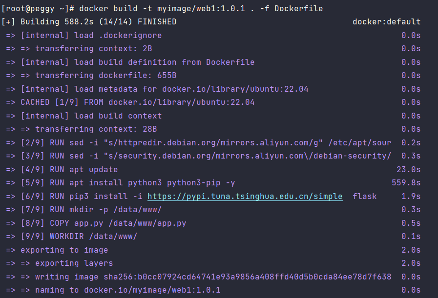
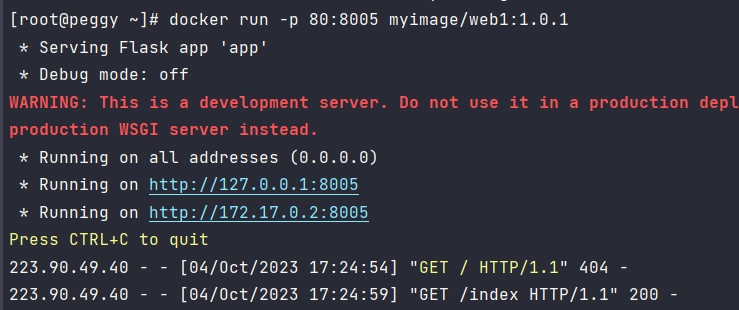
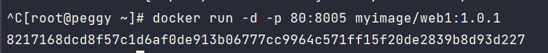
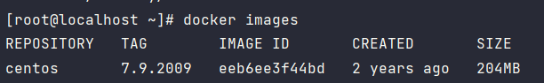
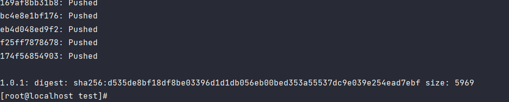

Docker
======

Docker是一个用于 构建（build）、运行（run）、传送（share） 应用程序的平台。

Docker和虚拟机区别：

虚拟机（虚拟化）把物理服务器虚拟为虚拟服务器，完全独立，把一台服务器实现多台服务器功能。缺点：虚拟机占用很多系统资源，启动慢

Docker。容器（Container）技术，消耗资源少，启动快

**centos安装docker**

- 配置repo源

```
curl -o /etc/yum.repos.d/Centos-7.repo http://mirrors.aliyun.com/repo/Centos-7.repo

curl -o /etc/yum.repos.d/docker-ce.repo http://mirrors.aliyun.com/docker-ce/linux/centos/docker-ce.repo

yum clean all && yum makecache
```

- 查看可下载版本

```
yum list docker-ce --showduplicates | sort -r
```

- 安装

	```shell
	# 最新版
	yum install -y docker-ce  
	# 指定版本
	yum install -y docker-ce-24.0.6
	```

- 启动docker

	```shell
	systemctl enable docker  # docker开机启动
	systemctl start docker
	systemctl restart docker
	systemctl stop docker
	```

- 其他命令

	```python
	# 查看版本
	docker version
	
	# 查看docker信息
	docker info
	
	# 查看本机镜像
	docker images
	
	# 搜索网络镜像
	docker search
	
	# 拉取镜像
	docker pull 名字
	```


端口转发

```
cat <<EOF > /etc/sysctl.d/docker.conf
net.bridge.bridge-nf-call-ip6tables = 1
net.bridge.bridge-nf-call-iptables = 1
net.ipv4.conf.default.rp_filter = 0
net.ipv4.conf.all.rp_filter = 0
net.ipv4.ip_forward=1
EOF
```

```
sysctl -p /etc/sysctl.d/docker.conf
```


案例
----

centos docker ubuntu22.04 + python 代码

### 拉取镜像

```python
# 最新镜像
docker pull ubuntu
docker pull ubuntu:latest
# 根据版本
docker pull ubuntu:22.04
```

### 构建镜像

- Dockerfile文件

```
# Dockerfile

# Base images 基础镜像
FROM ubuntu:22.04
#MAINTAINER 维护者信息
maintainer t13299001916@gmail.com

#RUN 执行以下命令
# 
RUN sed -i "s/httpredir.debian.org/mirrors.aliyun.com/g" /etc/apt/sources.list
RUN sed -i "s/security.debian.org/mirrors.aliyun.com\/debian-security/g" /etc/apt/sources.list

RUN apt update
RUN apt install python3 python3-pip -y
RUN pip3 install -i https://pypi.tuna.tsinghua.edu.cn/simple  flask
RUN mkdir -p /data/www/

#拷贝文件至工作目录
COPY app.py /data/www/app.py

#工作目录
WORKDIR /data/www/

#容器启动时执行命令
CMD ["python3", "app.py"]
```

- Flask案例文件app.py

```
# app.py
from flask import Flask

app = Flask(__name__)

@app.route('/index')
def index():
    return '你好啊'

if __name__ == '__main__':
    app.run(host='0.0.0.0', port=8005)
```

- 命令构建自定义镜像

```python
docker build -t 自定义镜像/的名字:版本 目录 -f Dockerfile

# 例
docker build -t myimage/web1:1.0.1 . -f Dockerfile
    
# 关闭下载、clone、安装等缓存
# 第一次构建时下载的内容，为了后续构建时候提高速度，会有缓存。根据需要是否关闭缓存
docker build -t myimage/web1:1.0.2 . -f Dockerfile --no-cache

docker build -t myimage/web1:1.0.2 . Dockerfile 
docker build -t cocacola137/centos79python39 . -f Dockerfile 

docker run -it cocacola137/test:1.0.1 --rm bash
```



成功构建镜像

### 创建容器并运行

- 阻塞运行

```python
docker run -p 宿主机端口号:容器监听端口 镜像名字:版本号
# 例
docker run -p 80:8005 myimage/web1:1.0.1
```



显示这个

访问网址120.46.209.92:80/index 能运行说明正常

- 后台运行

```python
# 后台运行
docker run -d -p 80:8005 myimage/web1:1.0.1
```



返回容器ID

服务能正常访问，容器运行正常 


**注意：**

容器中必须有前台进程，否则容器创建后立即销毁

**建议：宿主机后台进程运行+容器前台进程运行**

```
# 例如，如果在容器内，后台启动的nginx进程，容器创建后会立即销毁
systemctl start nginx
```

```
# 应该，前台进程阻塞
nginx -c /etc/nginx/nginx.conf -g 'daemon off;'
```

- 创建时进入容器

```python
# 在创建容器时，直接接入容器，进入bash
# 如果退出bash时，容器内没有前台进程，容器创建后会立即销毁
docker run -ti --rm myimage/web1:1.0.1 bash
docker run -ti --rm myimage/web1:1.0.1 sh
        
# 人为添加前台进程(尽量不要)
docker run -ti -d  myimage/web1:1.0.1 tail /etc/hosts -f
```


再次进入存活的容器

```
docker exec -ti 容器ID bash  
```


### 停止和删除容器

```python
# 宿主机，罗列正在运行的容器
docker ps

# 宿主机，罗列所有容器（包含停止的）
docker ps -a
```

```python
# 停止容器（可以停止多个）
docker stop 容器ID前几位 容器ID前几位 容器ID前几位 容器ID前几位
# 停止所有容器
docker stop 'docker ps -ap'
```

```python
# 删除容器（可以删除多个）
docker rm 容器ID前几位 容器ID前几位 容器ID前几位 容器ID前几位
# 删除之后无法查看到

# 删除所有容器
docker rm 'docker ps -ap'
```

### Dockerfile

- 创建镜像时运行

```python
# Base images 基础镜像
FROM 镜像:版本
#MAINTAINER  维护者信息
maintainer <name> <email>

# COPY|ADD 添加宿主机文件到镜像中
COPY 宿主机文件路径 镜像中文件路径
ADD hom* /mydir/     # 添加所有以hom开头的文件
ADD test /           # 添加test文件倒/目录下
# 注意：如果针对压缩包使用ADD的话，会自动解压。

# WORKDIR 工作目录（进入到目录）
WORKDIR /path

# RUN 执行linux系统命令 
RUN linux命令

# ENV 环境变量，给路径起一个别名
ENV <key> <value>    或  ENV <key>=<value>
# 例
ENV XXX /data/www
RUN mkdir $XX/abc
ADD test $XX/abc

# EXPOST 映射端口（可以不写）
EXPOST 80
```

- 容器运行时

```python
# 在容器启动时执行命令，只能执行最后一条
CMD ["python3", "app.py"]
ENTRYPOINT ["python3", "app.py"]
# CMD可以被docker run命令覆盖掉，
```

#### 减小镜像大小

1. 每个RUN都会在容器上多封装一层,最好整合多个RUN语句为一行
2. 已经安装好的程序,删除安装包

#### 文件挂载


案例
----

### 环境

宿主机centos7.9.2009

容器 centos7.9.2009

python3.9.7

django 3.2

### 拉取centos镜像

```python
curl -o /etc/yum.repos.d/Centos-7.repo http://mirrors.aliyun.com/repo/Centos-7.repo

curl -o /etc/yum.repos.d/docker-ce.repo http://mirrors.aliyun.com/docker-ce/linux/centos/docker-ce.repo

yum clean all && yum makecache

yum install -y docker-ce-24.0.6

systemctl start docker

docker version

docker pull centos:7.9.2009

docker images
```



### Dockerfile

```shell

# Dockerfile

# Base images 基础镜像
FROM centos:7.9.2009
#MAINTAINER 维护者信息
MAINTAINER peppapig t13299001916@gmail.com

#RUN 执行以下命令
# RUN sed -i "s/httpredir.debian.org/mirrors.aliyun.com/g" /etc/apt/sources.list
# RUN sed -i "s/security.debian.org/mirrors.aliyun.com\/debian-security/g" /etc/apt/sources.list


# Python依赖(GCC编译器)
RUN yum install -y gcc zlib zlib-devel bzip2 bzip2-devel ncurses ncurses-devel readline readline-devel openssl openssl-devel  xz lzma xz-devel sqlite sqlite-devel gdbm gdbm-devel tk tk-devel  mysql-devel python-devel libffi-devel

# wget
RUN yum install wget -y

# 目录
RUN mkdir -p /data/
WORKDIR /data/

# SQLite 3.7升级3.9
RUN wget https://www.sqlite.org/2023/sqlite-autoconf-3430100.tar.gz  --no-check-certificate
RUN tar -zxvf sqlite-autoconf-3430100.tar.gz
WORKDIR /data/sqlite-autoconf-3430100
RUN ./configure
RUN make && make install
ENV LD_LIBRARY_PATH="/usr/local/lib"

# Python3.9环境
WORKDIR /data/
RUN wget http://npm.taobao.org/mirrors/python/3.9.7/Python-3.9.7.tgz
RUN tar -zxvf  Python-3.9.7.tgz
WORKDIR /data/Python-3.9.7/
RUN ./configure --prefix=/usr/local/python3/python39/
RUN make && make install
RUN ln -sf /usr/local/python3/python39/bin/python3.9 /usr/bin/python3
RUN ln -sf /usr/local/python3/python39/bin/pip3.9 /usr/bin/pip3
RUN pip3 config set global.index-url https://mirrors.aliyun.com/pypi/simple 

# git
RUN yum install git -y
RUN git config --global user.name "peppapig"
RUN git config --global user.email "t13299001916@gmail.com"

# git拉代码
WORKDIR /data/
RUN git clone https://gitee.com/wupeiqi/blog.git

# pip安装依赖
RUN pip3 install django==3.2

# 运行项目
WORKDIR /data/blog

CMD ["python3", 'manage.py', 'runserver', '0.0.0.0:8001']
```

```shell
docker build -t centos/wupeiqi:1.0.2 . -f Dockerfile
```

```shell
docker run -d -p 80:8001 centos/wupeiqi:1.0.2
```

提示python3 命令报错，进入bash可以使用python3，不清楚原因，改用下面方法运行成功

```shell
docker run -d -p 80:8001 centos/wupeiqi:1.0.2 python3 manage.py runserver 0.0.0.0:8001
```

发布和下载
----------

注册DockerHub


### 登陆

```shell
docker login
# 输入邮箱和密码
cc13299001916@gmail.com
dadishen0022.
```

### 镜像推到dockerhub

注意：**以后构建镜像时候， DockerID/镜像名:版本号**

否则无法推送到公共镜像

```shell
# 把镜像推送到dockerhub
docker push cocacola137/ct79py39dj32:1.0.1
```




### 镜像拉到本地

```
docker pull cocacola137/ct79py39dj32:1.0.1
```


## Mysql容器

- 拉取镜像

```shell
docker pull mysql:5.7
```

- 运行容器

```shell
docker run \
-p 3306:3306 \
--name mysql57 \
-v ~/mysql/data:/var/lib/mysql \
-v /etc/localtime:/etc/localtime:ro \
-e MYSQL_ROOT_PASSWORD=007741ak \
--privileged=true \
docker.io/mysql:5.7.43

```

```shell
# 上面命令解释
docker run \
-p 3306:3306 \
--name mysql57 \  # 容器名字
-v ~/mysql/data:/var/lib/mysql \  # 文件挂载
-v /etc/localtime:/etc/localtime:ro \  # 修改容器时间为宿主机时间
-e MYSQL_ROOT_PASSWORD=123456 \  # root密码
-- privileged=true \   # 权限
docker.io/mysql:5.7.43  
```

- 查看容器状态

  ```
  docker ps
  ```

- 远程链接成功

  ```
  123.60.79.108:3306 
  root 
  007741ak
  ```

## Redis容器

- 拉取镜像

```shell
docker pull redis:7.2.1
```

- 运行容器

```shell
docker run \
--restart=always \
--log-opt max-size=100m \
--log-opt max-file=2 \
-p 6379:6379 \
--name redis72 \
-v ~/redis/myredis/myredis.conf:/etc/redis/redis.conf \
-v ~/redis/myredis/data:/data \
-v /etc/localtime:/etc/localtime:ro \
-d redis:7.2.1 redis-server /etc/redis/redis.conf \
--appendonly yes \
--requirepass 007741ak
```

```shell
# 命令解释
docker run \
--restart=always \   # 启动方式，开机启动
--log-opt max-size=100m \   # 日志配置
--log-opt max-file=2 \
-p 6379:6379 \  # 暴露端口号
--name redis72 \  # 容器名
-v ~/redis/myredis/myredis.conf:/etc/redis/redis.conf \
-v ~/redis/myredis/data:/data \
-d redis:7.2.1 redis-server /etc/redis/redis.conf \  # Redis使用配置文件启动
--appendonly yes \  # 开启持久化
--requirepass 007741ak   # 设置redis密码
```

- 查看容器状态

  ```
  docker ps
  ```

- 远程链接成功

  ```
  123.60.79.108:6379 
  默认用户名：default 
  密码 007741ak
  ```

## 构建python3.9.7 docker镜像

dockerfile

```sh
# Dockerfile

# Base images 基础镜像
FROM centos:7.8.2003
#MAINTAINER 维护者信息
MAINTAINER peppapig t13299001916@gmail.com

#RUN 执行以下命令
# RUN sed -i "s/httpredir.debian.org/mirrors.aliyun.com/g" /etc/apt/sources.list
# RUN sed -i "s/security.debian.org/mirrors.aliyun.com\/debian-security/g" /etc/apt/sources.list


# Python依赖
RUN yum install -y gcc zlib zlib-devel bzip2 bzip2-devel ncurses ncurses-devel readline readline-devel openssl openssl-devel  xz lzma xz-devel sqlite sqlite-devel gdbm gdbm-devel tk tk-devel  mysql-devel python-devel libffi-devel wget

# 目录
RUN mkdir -p /www/
WORKDIR /home/

# SQLite 3.7升级3.9
RUN wget https://www.sqlite.org/2023/sqlite-autoconf-3430100.tar.gz  --no-check-certificate
RUN tar -zxvf sqlite-autoconf-3430100.tar.gz
WORKDIR /home/sqlite-autoconf-3430100
RUN ./configure
RUN make && make install
ENV LD_LIBRARY_PATH="/usr/local/lib"
WORKDIR /home/
RUN rm sqlite-autoconf-3430100.tar.gz


# Python3.9环境
RUN wget http://npm.taobao.org/mirrors/python/3.9.7/Python-3.9.7.tgz
RUN tar -zxvf  Python-3.9.7.tgz
WORKDIR /home/Python-3.9.7/
RUN ./configure --prefix=/usr/local/python3/python39/
RUN make && make install
RUN ln -sf /usr/local/python3/python39/bin/python3.9 /usr/bin/python3
RUN ln -sf /usr/local/python3/python39/bin/pip3.9 /usr/bin/pip3
RUN pip3 config set global.index-url https://mirrors.aliyun.com/pypi/simple 
WORKDIR /home/
RUN rm Python-3.9.7.tgz

# git
RUN yum install git -y
RUN yum clean all
```

```sh
docker build -t cocacola137/centos78python39:1.0.1 . -f Dockerfile --no-cache
```

```shell
# -it进入容器，--rm退出后删除容器
docker run -it --rm -p 8010:8010 --privileged cocacola137/centos78python39:1.0.1 bash 
```


## 项目容器

```
# 使用Bash脚本作为入口点
ENTRYPOINT ["/www/wwwroot/start.sh"]
```

```sh
#Dockerfile

# Base images 基础镜像
FROM cocacola137/centos78python39:1.0.1
#MAINTAINER 维护者信息
MAINTAINER peppapig t13299001916@gmail.com

RUN git config --global user.name "PeppaPig0o0"
RUN git config --global user.email "t13299001916@gmail.com"

# git拉代码
RUN git clone https://gitee.com/tangdi111/wwwroot.git 
WORKDIR /www/wwwroot/peppa
COPY ./requirements.txt /www/wwwroot/peppa
RUN pip3 install -r requirements.txt -i https://pypi.tuna.tsinghua.edu.cn/simple

RUN ln -s /usr/local/python3/python39/bin/uwsgi /usr/bin/uwsgi
 
# 运行项目
WORKDIR /www/wwwroot
EXPOSE 8010 8011

# 使用Bash脚本作为入口点
ENTRYPOINT ["/www/wwwroot/start.sh"]
```

```
docker build -t cocacola137/wwwroot:1.0.1 . -f Dockerfile --no-cache
```


### job项目

域名tdnote.top

```bash
#Dockerfile

# Base images 基础镜像
FROM cocacola137/centos78python39:1.0.1
#MAINTAINER 维护者信息
MAINTAINER peppapig t13299001916@gmail.com

#RUN git config --global user.name "PeppaPig0o0"
#RUN git config --global user.email "t13299001916@gmail.com"

# COPY
COPY ./job /www/job

WORKDIR /www/job
RUN pip3 install -r requirements.txt -i https://pypi.tuna.tsinghua.edu.cn/simple

RUN ln -s /usr/local/python3/python39/bin/uwsgi /usr/bin/uwsgi

# 运行项目
WORKDIR /www/job
EXPOSE 8000

# 使用Bash脚本作为入口点
# ENTRYPOINT ["/www/wwwroot/start.sh"]
```

```
docker build -t peppapig010/job:1.0.1 . -f Dockerfile --no-cache
```

```
# 进入容器，退出后删除容器 宿主机端口:容器端口
docker run -it -p 8001:8000 --privileged peppapig010/job:1.0.1 bash 
```

### peppa项目

域名ipeppapig.top

```bash
#Dockerfile

# Base images 基础镜像
FROM cocacola137/centos78python39:1.0.1
#MAINTAINER 维护者信息
MAINTAINER peppapig t13299001916@gmail.com

#RUN git config --global user.name "PeppaPig0o0"
#RUN git config --global user.email "t13299001916@gmail.com"

# COPY
COPY ./peppa /www/peppa

WORKDIR /www/peppa
RUN pip3 install -r requirements.txt -i https://pypi.tuna.tsinghua.edu.cn/simple

RUN ln -s /usr/local/python3/python39/bin/uwsgi /usr/bin/uwsgi

# 运行项目
WORKDIR /www/peppa/peppa
RUN uwsgi -i peppa.ini
EXPOSE 8000

# 使用Bash脚本作为入口点
# ENTRYPOINT ["/www/wwwroot/start.sh"]
```

```
docker build -t peppapig010/peppa:1.0.1 . -f Dockerfile --no-cache
```

```
docker run -d -p 8002:8000 --privileged peppapig010/peppa:1.0.1
# 进入容器，退出后删除容器 宿主机端口:容器端口
docker run -it -p 8002:8000 --privileged peppapig010/peppa:1.0.1 bash 
```

```
docker run -it -p 8002:8000 --privileged peppapig010/peppa:1.0.1 tail -20f /www/peppa/peppa/uwsgi.log 
```


### 以前的

```
# Dockerfile

# Base images 基础镜像
FROM cocacola137/centos78python39:1.0.1
#MAINTAINER 维护者信息
MAINTAINER peppapig t13299001916@gmail.com

# git拉代码
COPY ./wwwroot /www/wwwroot

WORKDIR /www/peppa
# COPY ./requirements.txt /www/wwwroot/peppa
RUN pip3 install -r requirements.txt -i https://pypi.tuna.tsinghua.edu.cn/simple

RUN ln -s /usr/local/python3/python39/bin/uwsgi /usr/bin/uwsgi

# 运行项目
WORKDIR /www/wwwroot
EXPOSE 8010 8011

# 使用Bash脚本作为入口点
# ENTRYPOINT ["/www/wwwroot/start.sh"]


```


start.sh

```sh
#!/bin/bash

# 启动第一个uWSGI应用程序
uwsgi -i /www/wwwroot/peppa/peppa/peppa.ini &

# 等待一段时间（例如5秒，根据实际情况调整）
sleep 5

# 启动第二个uWSGI应用程序
uwsgi -i /www/wwwroot/job/job/job.ini &

# 防止脚本退出，以保持容器运行
tail -f /dev/null
```

```
# 进入容器，退出后删除容器 宿主机端口:容器端口
docker run -it --rm -p 8010:8010 -p 8011:8011 --privileged cocacola137/wwwroot:1.0.1 bash 
```

```
# 进入容器，退出后删除容器 宿主机端口:容器端口
docker run -it -p 8012:8010 --privileged cocacola137/wwwroot:1.0.1 bash 
```

