Git
===

安装
----

https://git-scm.com/ 官网

Windows

下载安装


Centos

```
yum install git
```

Ubuntu

```
apt-get install git
```

查看git版本

```
git -v
```


配置
----

用户名和邮箱

```
# 如果用户名中间有空格，需要加双引号
git config --global user.name "peppapig"
git config --global user.email t13299001916@gmail.com

# global 全局配置
# system 系统配置  一般不用
```

保存用户名和密码

```
git config --global credential.helper store
```

查看git配置

```
git config --global --list
```

创建仓库
--------

```
方法一
在自己电脑上新建一个仓库
git init
```

```
方法二
从远程服务器上克隆一个已经存在的仓库
git clone 仓库地址
```

基本命令
--------

### 文件状态

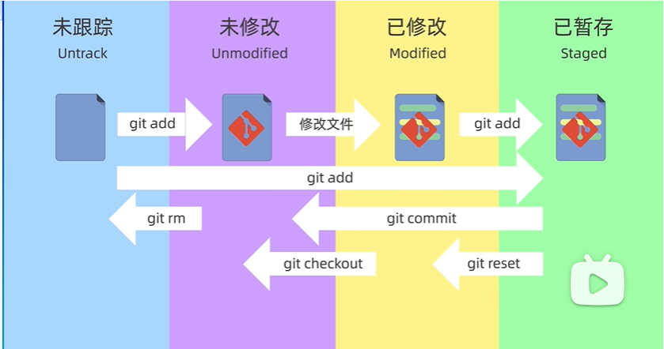

```
把一个文件提交到缓存区
git add 文件名
```

```
查看暂存区文件内容
git ls-files
```

```
从暂存区删除一个缓存
git rm --cached <file>
```

```
提交（缓存区）文件，不会提交工作区
不加-m会进入vim内容编辑页
git commit -m "信息"
```

```
查看提交记录
git log
git log --oneline  简洁模式
```

### 退回版本

```
git reset V1
```

git reset 三种模式

```
软
回退到某一个版本，保留工作区和暂存区的已修改内容
git reset --soft
```

```
硬
回退到某一个版本，丢弃工作区和暂存区的已修改内容，一般不用
git reset --hard
```

```
混合（reset的默认参数，介于soft和hard之间）
回退到某一个版本，保留工作区已修改内容，丢弃暂存区的已修改内容
git reset --mixed
```

如果不小心hard回退，可以使用

```
git reflog
```

### 查看差异

git diff 

查看文件在工作区、暂存区、仓库之间的差异

也可以产看文件在不同版本之间的差异

#### 查看工作区和暂存区之间的差异

```
默认
git diff 
git diff 文件名
```

#### 查看工作区和版本库之间的差异

```
git diff HEAD
```

#### 查看暂存区和版本库之间的差异

```
git diff --cache
```

#### 查看两个版本之间的差异

```
git diff 提交ID 提交ID
git diff HEAD 提交ID
git diff HEAD~ HEAD

HEAD表示分支的最新版本，HEAD~表示上一个版本，HEAD~2表示HEAD之前2个版本
```

#### 查看某个文件不同版本差异

```
git diff HEAD~ HEAD filename
```

### 删除rm

方法一

```
rm 文件名              本地(工作区)删除一个文件
git add 文件名         提交到暂存区
git ls-files            查看暂存区文件
git commit -m ""      最后提交
```

方法二（推荐）

```
在工作区、暂存区同时删除这个文件
git rm 文件名
git commit -m ""      最后提交
```

```
git rm <file>   工作区、暂存区删除
git rm --cached <file>  暂存区删除,保留工作区的
git rm -r * 删除某个目录下所有子目录和文件

删除完不要忘了提交
```

### 忽略文件.gitignore

系统或软件自动生成的文件、

编译产生的中间文件或结果文件、

运行中自动生成的日志、缓存、临时文件

涉及身份、密码、口令、密钥等敏感信息文件

都不应该被加入版本库中

```
 # 把文件名 放入.gitignore文件中
 echo <file> > .gitignore
 # 查看.gitignore文件
 cat .gitignore
```

.gitignore 文件中，也可以使用通配符等

```
例如
*.log          所有.log文件
temp/			temp目录下所有文件

*通配任意个字符
?匹配单个字符
[]表示匹配列表中的单个字符  [abc],表示匹配a/b/c
[0-9]匹配一个数字  [a-z]任意一个小写字母
**匹配任意的中间目录
!取反
```

**.gitignore 作用前提：文件没有被提前加入到版本库中（否则.gitignore 不生效）**

GitHub
------

### SSH配置

```
项目根目录下
ssh-keygen -t rsa -b 4096
```

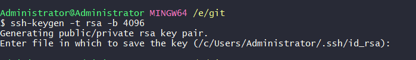

如果第一次生成，直接回车，生成id_rsa文件

如果不是第一次，回车会覆盖原密钥文件。需要输入新文件名

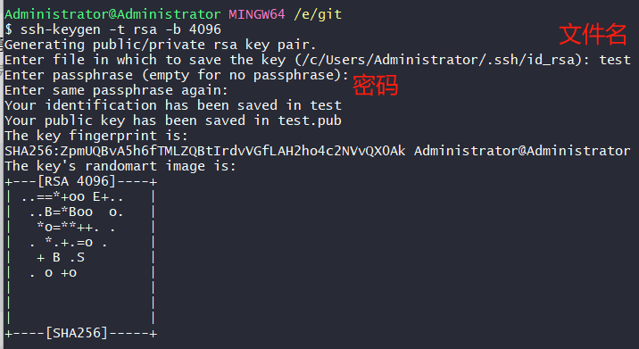

结果

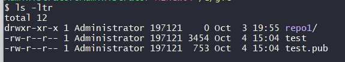

远程仓库克隆到本地

```
git clone 地址
```

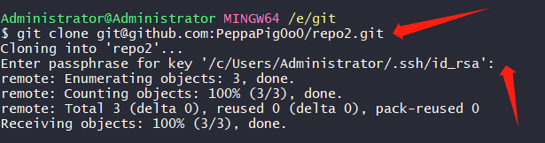


```
config中的配置
# github
Host github.com
HostName github.com
PreferredAuthentications publickey
IdentityFile /e/git/test
```

### Push  Pull

把本地仓库修改 推送给 远程仓库

```
git push
```

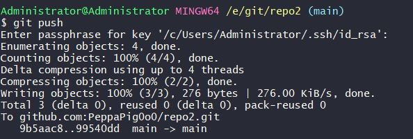

把远程仓库的修改 推送给 本地仓库

```
git pull
```

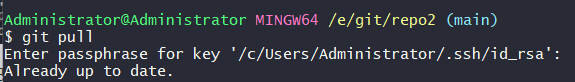

### 本地已有仓库上传github

```
git remote add origin git@github.com:PeppaPig0o0/repo3.git
```

```
# 查看当前仓库对应远程仓库的别名和地址
git remote -v 
```

```
# 指定当前分支名字为main（这句可以省略）
git branch -M main
# 把当前main分支和远程main分支关联起来
git push -u origin main:main
```

github 官方代码（根据需要写入）

```
# create a new repository on the command line
# 创建一个新项目push到github仓库
echo "# wwwroot" >> README.md
git init
git add README.md
git commit -m "first commit"
git branch -M main
git remote add origin git@github.com:PeppaPig0o0/wwwroot.git
git remote add origin git@github.com:PeppaPig0o0/-22-.git
git push -u origin main
```

```
# push an existing repository from the command line
# 已存在本地的项目push到github仓库
git remote add origin git@github.com:PeppaPig0o0/wwwroot.git
git branch -M main
git push -u origin main
```


分支
----

查看分支

```
git branch
```

创建分支

```
git branch 分支名
```

切换分支

```
git switch 分支名
```

合并分支

```
先切换回main分支，然后
git merge 分支名
```

删除分支

```
# 已合并
git branch -d 分支名
# 未合并
git branch -D 分支名
```

合并冲突
--------

如果修改了同一个文件的同一行，就会产生冲突。需要手动产生冲突

```

```

rebase
------

变基另一个分支的末尾

```
git switch feat
git rebase main
# 找到feat和main分支交点，把feat分支所有节点变基到main分支末尾
```

Git命令表
---------


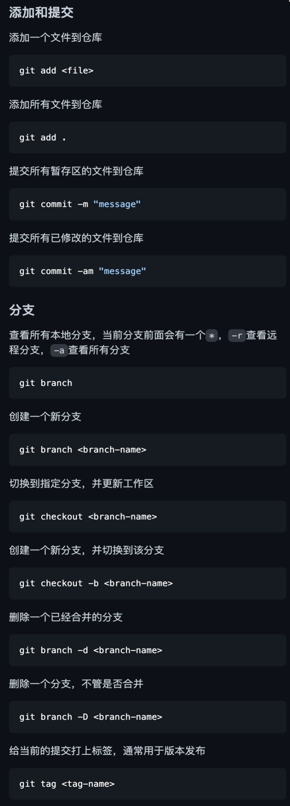

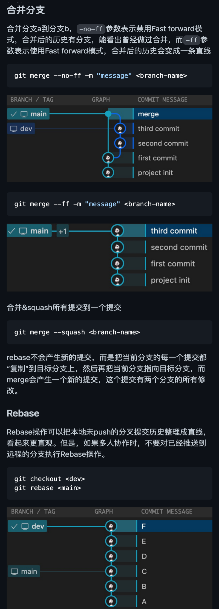

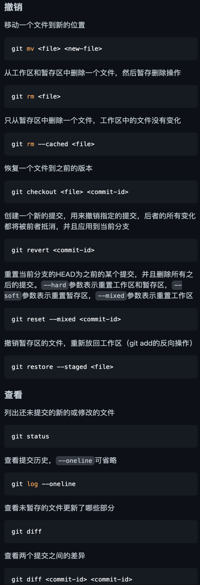

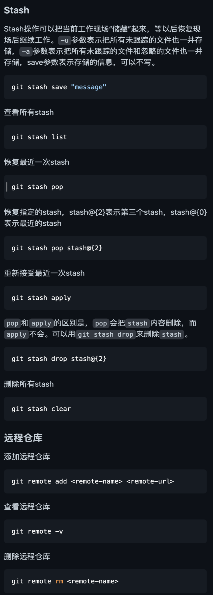

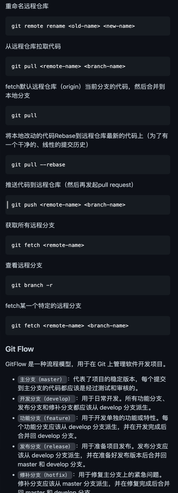


## 常见报错

### 权限


```shell
# 运行
git config --global --add safe.directory "*";
```

### push错误


