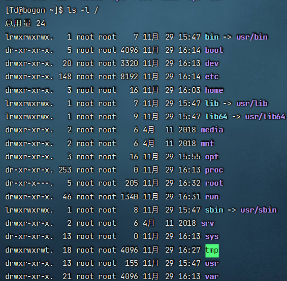
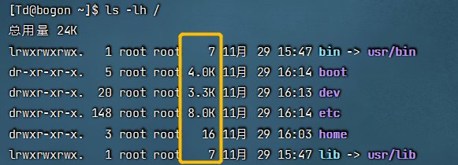
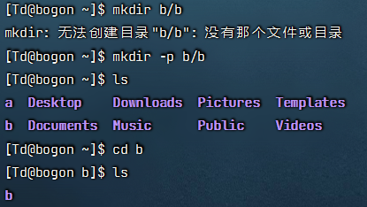

Linux——centos
=============

#### 1.ls命令

ls [-a -l -h]  [路径]

​	.	当前目录

​	..	上级目录

​	~	HOME目录

##### -a 列出隐藏文件

##### -l 查看更多信息

平铺的内容竖向列出来

##### -h 以易于阅读方式列出文件大小

和 -l 一起使用

#### 2.cd  切换目录

cd [路径]

不写目录，回到home中去

#### 3.pwd 输出当前工作目录

#### 4.mkdir 创建新目录

mkdir [-p] 路径

-p 自动创建不存在的父目录

#### 5.touch 创建文件

touch 路径

#### 6.cat 查看内容

cat 路径

#### 7.more 查看内容

more 路径

查看过程中可以通过 按空格翻页，按q退出    

