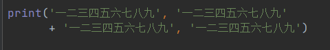
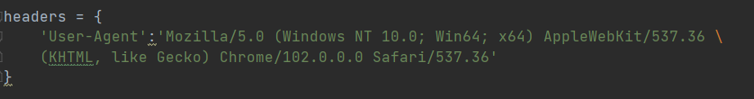

编程规范
========

一、代码布局
------------

1. Python使用4个空格来缩进，或使用1个制表符

​		不允许同时使用空格和制表符来缩进

2. 所有行限制的最大字符数为79

​			没有结构化限制的大块文本（文档字符或者注释等），每行最大字符数限制在72

​			括号内可以换行

​		字符串可以使用斜杠换行

3. 顶层函数和类的定义，前后用两个空行隔开

​		类里的方法定义用一个空行隔开

4. 变量赋值和导入声明之间插入空行，分割语义

5. 导入通常在分开的行，不建议一次导入两个包；不建议通配符导入

6. 避免添加空格：

​		小括号、中括号、大括号后；

​				逗号、分号、冒号之前；

​				函数参数的左括号之前。

​				函数定义时，参数默认值不加空格

​		总是在二元运算符两边各加一个空格：

​				赋值；比较；逻辑运算符等

7. 避免一行多个语句

二、命名规范
------------

1. 使用英文单词命名，尽量不要使用英文简拼

2. 不要害怕过长的命名变量

3. 避免重复使用变量名表示不同的对象

4. 不能使用内建名称

5. 避免使用o和l  与0和1容易混淆

6. 避免使用大小写区分不同对象

7. 使用下划线分割单词，提高可读性

8. 大写字母表示常量

9. 模块-简短全小写名字，可以加下划线；

	| 模块   | 简短全小写     | 可以加下划线     |
	| ------ | -------------- | ---------------- |
	| **包** | **简短全小写** | **不建议下划线** |
	| 类     | 首字母大写     |                  |
	| 函数   | 小写           | 可以加下划线     |
	| 常量   | 全大写         | 可以加下划线三、 |

三、注释原则

1. 代码更新时，优先更新注释
2. 注释应该是完整的句子
3. 如果注释很短，结尾句号可以省略；块注释每句话结束有句号
4. 句尾结束，使用两个空格
5. 尽量使用英文注释

1. 块注释- > 通常适用于跟随他们的某些代码，并缩进到与代码相同级别
2. 行注释 -> 行内注释与代码至少要空两格
3. 文档注释 -> 三个引号，要为所有的公共模块、函数、类、方法编写文档说明。非公共方法不必要