Python复习
==========

一、基础语法
------------

### 1.1 输入输出

```python
#input 函数接收的输入，全都是字符串类型，不能参与数学运算
name = input('请输入你的名字：')

#把input 接收到的输入，先转换成数字类型，则可以进行运算
age = int(input('请输入你的年龄：'))
```

```python
#print() 可以输出任何类型的数据
print('我的名字是张三')
print(555)

#一个print 可以在一行中打印很多个数据, 用英文  逗号 隔开
# 逗号隔开的数据，中间会有空格
print('我的名字是',name,'我的年龄是',age)
```

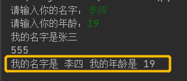

```python
#  +  加号可以对  相同类型的数据   进行运算
print(50+25)    #对数字进行+，是加法
print('大家好'+'同学们')   #对字符串进行+，是拼接
print('我的年龄是'+16)  #不同类型数据用+，会报错
```

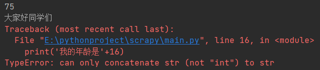

```python
#数字类型和布尔类型相加，True =1  ,False = 0
print(15+True)  #
print(15.3 + False)

#字符串和布尔类型不能相加 , 报错
print('你好'+True)
```


### 1.2基本数据类型

#### 数字、字符串、布尔

```python
#type()输出变量的类型

#数字
a = 37  #整数
print(type(a))
b = 25.975  #浮点数
print(type(b))

#字符串  单引号和双引号都可以，三个单引号中的字符串可以换行
c = 'abcde'
d = '''
abc
def
ghi
'''
print(c)
print(d)

#布尔类型  只有两个值  True False  (第一个字母必须是大写)
e = True
f = False
print(e,f)
```

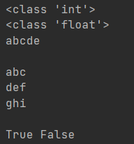

#### 强制类型转换

```python
a = 10
b = str(a) #把一个变量转换成 字符串->str 类型
c = int(a) #把一个变量转换成 整数 -> int 类型
d = float(a) #把一个变量转换成 浮点数 -> float 类型
print(b , c , d)
print( type(b) , type(c) , type(d) )
```

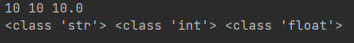

```python
#把字符串转成整数或浮点数，需要字符串没有字母和符号
a = '58'
print( int(a) )
print( float(a) )
#只有浮点数的字符串，可以用float()转换成浮点数,
# 但是因为有小数点，不能转成int类型
c = '49.65'  
print( float(c) )
#带有字母或符号的字符串，不能转数字
b = '59hello'
print( int(b) )  #报错
```

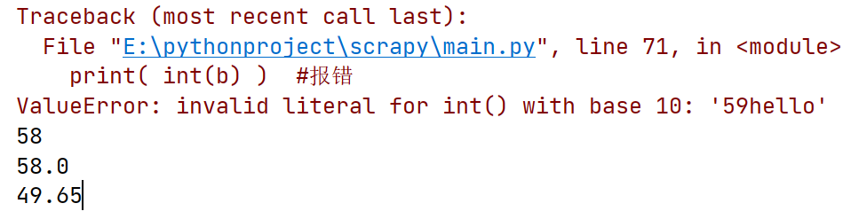

```python
a = True
b = str(a) #把一个变量转换成 字符串->str 类型
c = int(a) #把一个变量转换成 整数 -> int 类型
d = float(a) #把一个变量转换成 浮点数 -> float 类型
print(b , c , d)
print( type(b) , type(c) , type(d) )
```

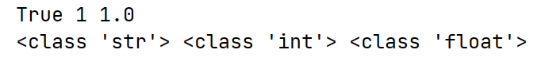

### 1.3运算符

#### 算术运算符

```python
print(20 + 16)
print(15 - 7)
print(4 * 7)
print(10 / 3)
print(17 % 4)  #取余数  17/4 = 4 余 1
print(17 // 4)  #取整数  17/4 = 4 余 1
print(2 ** 4)   # 2的4次方
```


#### 比较运算符

```python
#比较运算符，一定返回 布尔类型  True 或者 False
a = 30
b = 90
print(a >= 20)
print(10 < a < 50 < b < 100)
print(a > 86)
print(a == 32)
print(a != 32)
```

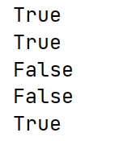

#### 逻辑运算符

```python
#逻辑运算符  and  or   not
a = 30
b = 56
if (a<50) and (b>30):
    print('两个条件都满足，才会为真')

if (a<50) or (b>100):
    print('满足一个条件，就为真')

if not (a>300):
    print('把表达式结果反过来','not真->假','not假->真')
```

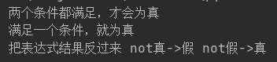


二、编码规范
------------

### 2.1注释

```python
注释里的内容不会被执行

#  ->    #后面的是注释，单行注释


'''
三个引号中间的多行注释
注释1
注释1
注释1
注释1
'''
```


### 2.2缩进

```python
#一个tab 或者 4个空格表示代码的层次
a = 50

if a==50:
	print('这段话是在if结构 中 的')

print('这段话是在if结构 外 的')
```

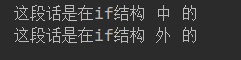

三、判断结构
------------

if 和 elif 后面跟条件 ，else 表示前面条件都不满足时执行

```python
#if结构，一旦有一个条件满足被执行，其他的所有条件就不会再判断了，无论是否满足
a = 50
b = 30
if a>100:
    print('a大于100')
elif b>50:
    print('b大于50')
elif b>20:
    print('b大于20')
elif b>10:
    print('b大于10')
else:
    print('a大于10')
```

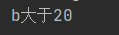


四、循环结构
------------

### 4.1 while循环

```
# while 条件:
#     循环体1
#     循环体1
#     循环体1
```

```python
import time
#while 条件为 0  0.0  False  []  {}  None  '' ，恒为假
#条件为        任何非0数字，非空字符串、列表、字典等，恒为真

a = input('请输入:')
while a:
    print('满足条件')
    time.sleep(2)
```

```python
'''
斐波那契数列
1、1、2、3、5、8、13、21、34、……
a  b c
   a b  c
     a  b  c
输出 500以内的斐波那契数列
'''
a = 1
b = 1
print(a,b,'',end='')
c = 0
while (a+b) < 500 :
    c = a + b
    print(c,' ',end='')
    a = b
    b = c
```

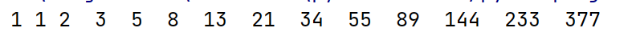

### 4.2 for循环