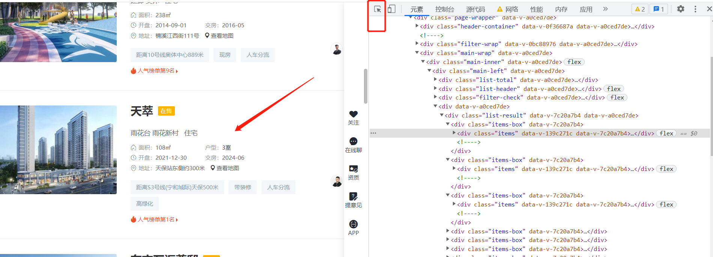
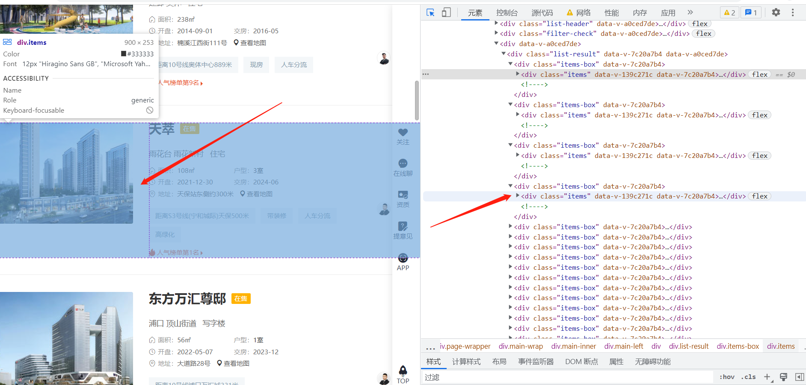

Q房网
=====

一、爬虫基本结构
----------------

1. #### 引入必要模块

	```python
	import requests
	from lxml import etree
	import time
	import random
	```

	

2. #### 构造url和头部

	```python
	# 列表页url
	url = 'https://nanjing.qfang.com/newhouse/list'
	headers = {
	    'User-Agent': 'Mozilla/5.0 (Windows NT 10.0; Win64; x64) AppleWebKit/537.36 (KHTML, like Gecko) Chrome/105.0.0.0 Safari/537.36'
	}
	```

	

3. #### 发起请求

	```python
	response = requests.get(url=url, headers=headers)
	```

	

4. #### 检查请求下来的数据

	```python
	print(response.status_code)
	print(response.text)
	
	```

	

5. #### 解析页面

	###### 1.网页空白位置，右键检查（打开开发者工具），左上角小箭头，然后点击需要的元素

	

	

	###### 2.然后开发者工具中，出现对应元素（高亮）

	

	

	###### 3.复制元素对应的属性和值，写出xpath路径（在对应元素上 右键，复制完整的xpath）

	```python
	html = etree.HTML(response.text)
	div_list = html.xpath('//div[@class="items-box"]/div[@class="items"]')
	```

	

6. #### 打印并验证需要采集的数据

	```python
	for div in div_list:
	    title = div.xpath('.//h3/text()')[0]  # 楼盘
	    street = div.xpath('.//p[@class="meta-items region"]/text()')[0]  # 所在街道
	    area = div.xpath('.//span[@class="con"]/text()')[0]  # 面积
	    price = div.xpath('.//span[@class="amount"]/text()')[0]  # 单价
	    total = div.xpath('.//p[@class="smaller"]/text()')[0]  # 总价
	    print(street,area,price,total)
	```

	

7. #### 请求子页面数据

	```python
	for div in div_list:
	    title = div.xpath('.//h3/text()')[0]  # 楼盘
	    street = div.xpath('.//p[@class="meta-items region"]/text()')[0]  # 所在街道
	    area = div.xpath('.//span[@class="con"]/text()')[0]  # 面积
	    price = div.xpath('.//span[@class="amount"]/text()')[0]  # 单价
	    total = div.xpath('.//p[@class="smaller"]/text()')[0]  # 总价
	    href = 'https://nanjing.qfang.com' + div.xpath('.//a[@class="house-title"]/@href')[0]  # 总价
	    # print(street,area,price,total)
	
	    r = requests.get(url=href, headers=headers)
	    r_html = etree.HTML(r.text)
	    use = r_html.xpath('//div[@class="item-package"]/div/p/text()')  # 用途
	    print(use)
	```

	

8. #### 分页请求

	```python
	# 分页
	for page in range(1, 20):
	    url = 'https://nanjing.qfang.com/newhouse/list/n' + str(page)
	
	    # 列表页url
	    # url = 'https://nanjing.qfang.com/newhouse/list/n1'
	    headers = {
	        'User-Agent': 'Mozilla/5.0 (Windows NT 10.0; Win64; x64) AppleWebKit/537.36 (KHTML, like Gecko) Chrome/105.0.0.0 Safari/537.36'
	    }
	
	    # 对列表页发起请求
	    response = requests.get(url=url, headers=headers)
	
	    # # 检查状态码和html页面是否正常
	    # print(response.status_code)
	```


二、爬虫源码
------------

```python
# 引入必要的标准库和第三方库
import requests
from lxml import etree
import time
import random
import csv

# utf-8 Unicode 编码 全球通用
# gbk gb2312 gb18030
fp = open('Q房网数据.csv', 'w', newline='', encoding='gb18030')
writer = csv.writer(fp)
writer.writerow(['楼盘', '位置', '类型', '均价', '总价'])

# 分页
for page in range(1, 4):
    # 生成每一页的url
    url = 'https://hangzhou.qfang.com/newhouse/list/n' + str(page)
    headers = {
        'User-Agent': 'Mozilla/5.0 (Windows NT 10.0; Win64; x64) AppleWebKit/537.36 (KHTML, like Gecko) Chrome/105.0.0.0 Safari/537.36'
    }

    # 请求列表页
    time.sleep(random.random())
    response = requests.get(url=url, headers=headers)
    # print(response.status_code)  # 查看响应状态码
    # print(response.text)  # 查看响应内容

    # 解析列表页
    html = etree.HTML(response.text)
    div_list = html.xpath('//div[@class="items-box"]/div[@class="items"]')

    # 遍历出每条数据
    for div in div_list:
        try:
            title = div.xpath('.//h3[@class="title"]/text()')[0]  # 楼盘
            position = div.xpath('.//p[@class="meta-items region"]/text()')[0]  # 位置
            types = div.xpath('.//p[@class="meta-items"]/text()')[0]  # 类型
            price = div.xpath('.//span[@class="amount"]/text()')[0]  # 均价
            total = div.xpath('.//p[@class="smaller"]/text()')[0]  # 总价
            print(title, position, types, price, total)
            writer.writerow([title, position, types, price, total])
        except:
            ...

fp.close()
```

