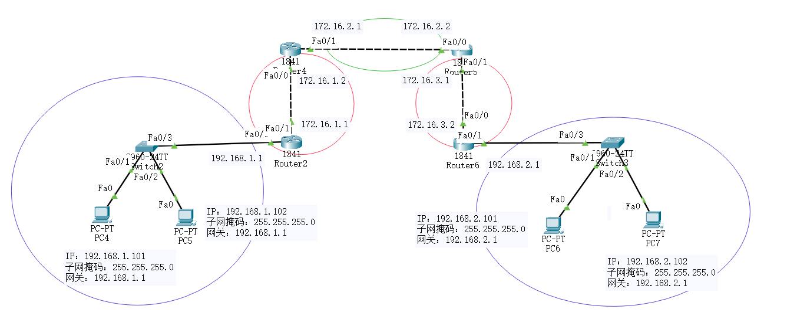
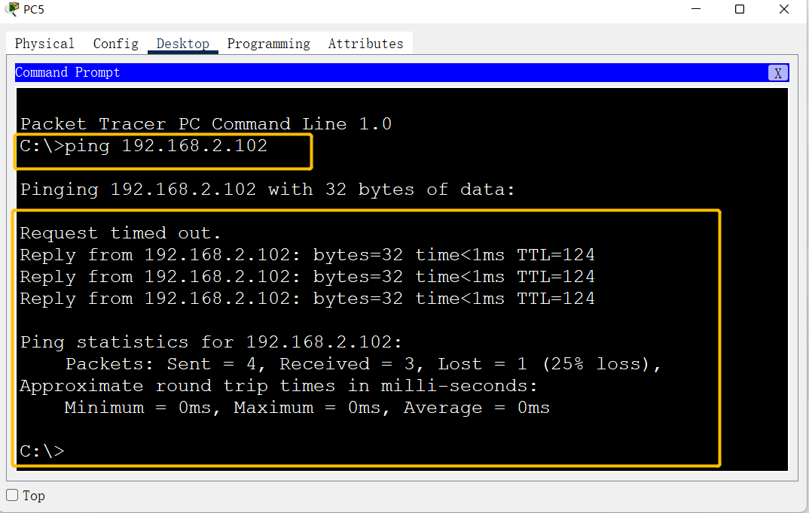
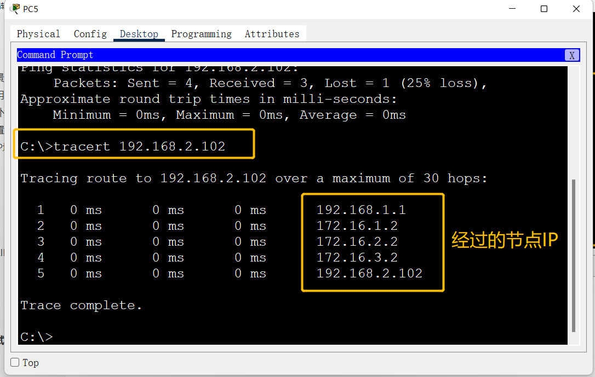

RIP
===

### 背景

在出现动态路由前，静态路由有几个问题无法解决：

1、网络拓扑或链路状态发生变化，需要对路由器的静态路由信息进行大范围修改，工作量大，工作复杂的高；

2、网络发送故障时，不能重选路由，很可能使路由失败

### 作用

路由器自动学习，自适应网络变化（最多只能15跳）

RIP怎么用

1. 路由器向邻居节点宣告自己的路由
2. 网络中的路由器从自己的邻居路由器得到路由信息，并将这些路由信息连同自己的本地路由信息发送给其他邻居
3. 这样一级一级的传递下去，达到全网同步
4. 每个路由器都不了解整个网络拓扑，他们只知道与自己直接相连的网络情况，并根据从邻居得到的路由信息更新自己的路由

### 拓扑结构



### 配置

#### 	IP地址配置

##### 	电脑

| 电脑    | IP地址            | 子网掩码          | 网关            |
| ------- | ----------------- | ----------------- | --------------- |
| *PC1*   | *192.168.1.101*   | *255.255.255.0*   | *192.168.1.1*   |
| *PC2*   | *192.168.1.102*   | *255.255.255.0*   | *192.168.1.1*   |
| **PC3** | **192.168.2.101** | **255.255.255.0** | **192.168.2.1** |
| **PC4** | **192.168.2.102** | **255.255.255.0** | **192.168.2.1** |

##### 	路由器1

```python
Router>enable
Router#conf t
Router(config)#hostname R1
R1(config)#
```

```python
R1#conf t

#关闭域名解释
R1(config)#no ip domain-look 
#配置0/0口的IP地址
R1(config)#int f0/0
R1(config-if)#ip add 192.168.1.1 255.255.255.0
R1(config-if)#no shutdown 
R1(config-if)#exit

#配置0/1口的IP地址
R1(config)#int f0/1
R1(config-if)#ip add 172.16.1.1 255.255.255.0
R1(config-if)#no shutdown 
R1(config-if)#exit
```

##### 	路由器2

```python
Router>enable
Router#conf t
Router(config)#hostname R2
R2(config)#
```

```python
R2#conf t

#关闭域名解释
R2(config)#no ip domain-look 
#配置0/0口的IP地址
R2(config)#int f0/0
R2(config-if)#ip add 172.16.1.2 255.255.255.0
R2(config-if)#no shutdown 
R2(config-if)#exit

#配置0/1口的IP地址
R2(config)#int f0/1
R2(config-if)#ip add 172.16.2.1 255.255.255.0
R2(config-if)#no shutdown 
R2(config-if)#exit
```

##### 	路由器3

```python
Router>enable
Router#conf t
Router(config)#hostname R3
R3(config)#
```

```python
R3#conf t

#关闭域名解释
R3(config)#no ip domain-look 
#配置0/0口的IP地址
R3(config)#int f0/0
R3(config-if)#ip add 172.16.2.2 255.255.255.0
R3(config-if)#no shutdown 
R3(config-if)#exit

#配置0/1口的IP地址
R3(config)#int f0/1
R3(config-if)#ip add 172.16.3.1 255.255.255.0
R3(config-if)#no shutdown 
R3(config-if)#exit
```

##### 	路由器4

```python
Router>enable
Router#conf t
Router(config)#hostname R4
R4(config)#
```

```python
R4#conf t

#关闭域名解释
R4(config)#no ip domain-look 
#配置0/0口的IP地址
R4(config)#int f0/0
R4(config-if)#ip add 172.16.3.2 255.255.255.0
R4(config-if)#no shutdown 
R4(config-if)#exit

#配置0/1口的IP地址
R4(config)#int f0/1
R4(config-if)#ip add 192.168.2.1 255.255.255.0
R4(config-if)#no shutdown 
R4(config-if)#exit
```

#### RIP配置

##### 路由器1

```python
R1(config)#router rip
R1(config-router)#version 2
R1(config-router)#network 192.168.1.0
R1(config-router)#network 172.16.1.0
```

##### 路由器2

```python
R2(config)#router rip
R2(config-router)#version 2
R2(config-router)#network 172.16.1.0
R2(config-router)#network 172.16.2.0
```

##### 路由器3

```python
R3(config)#router rip
R3(config-router)#version 2
R3(config-router)#network 172.16.2.0
R3(config-router)#network 172.16.3.0
```

##### 路由器4

```python
R4(config)#router rip
R4(config-router)#version 2
R4(config-router)#network 172.16.3.0
R4(config-router)#network 192.168.2.0
```

### 测试

使用左边电脑PING右边电脑，发现可以PING通




使用tracert 命令，ping右边电脑


