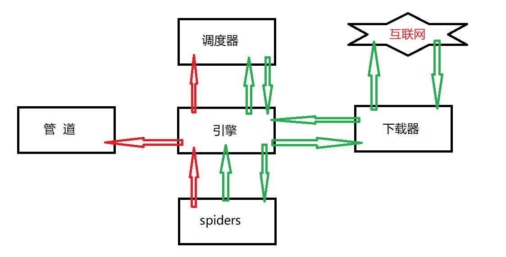

Scrapy
======

安装
----

```
pip install scrapy -i https://pypi.douban.com/simple
```

### 报错

​	1#如果报错，需要安装twisted库   ,  http://www.lfd.uci.edu/~gohlke/pythonlibs/#twisted   ,根据python版本进行下载，然后

```
pip install C:\........\Twisted-........whl  
pip install scrapy 
```

​	2#如果报错需要更新pip

```
python -m pip install --upgrade pip
```

​	3#win32报错

```
pip install pypiwin32
```

​	4# 如果还报错，使用  anaconda  ,  建议先安装 anaconda , 卸载系统Python解释器，使用anaconda环境


Scrapy项目创建
--------------

```
#终端，项目名不能数字开头，不可以中文
scrapy startproject test01
#在项目/spider文件夹下创建爬虫文件
# 爬虫文件名字， url 
scrapy genspider first https://www.baidu.com
```

```python
#相当于 response = request.get()
def parse(self, response):
    pass
```


运行
----

```
scrapy crawl first
```

​	#修改robot协议，settings.py  文件中第20行  ，注释  

```python
#不遵守robots协议
#ROBOTSTXT_OBEY = True
```


文件介绍
--------

项目名称

​	|-项目名称

​		|- spiders文件夹

​			|- init

​			|- 自定义的爬虫文件  #核心爬虫文件

​		|- init

​		|- items #定义数据结构的地方

​		|- middleware  #中间件 代理

​		|- pipelines #管道，用于处理下载的数据

​		|- settings  #配置文件


工作原理
--------

1、引擎向spiders要url

2、引擎将要爬取的url给调度器

3、调度器会将url生成请求对象放入指定的队列中

4、从队列中出队一个请求

5、引擎将请求交给下载器进行处理

6、下载器发送请求获取互联网数据

7、下载器将数据返回给引擎

8、引擎将数据再次给spiders

9、spiders通过xpath解析该数据，得到数据或url

10、spiders将数据或者url给引擎

11、引擎判断该数据是url还是数据，交给管道处理，如果是url交给调度器处理




scrapy shell

```
pip install ipython
```


response
--------

​	response的属性和方法

```python
response.text   #获取响应的字符串
response.body   #获取二进制数据
response.xpath()  #可以直接用XPATH来解析response中内容
response.extract() #提取selector对象的data属性值
response.extract_first() #提取selector列表的第一个数据
```


items.py
--------

```python
import scrapy

class DangItem(scrapy.Item):

    src = scrapy.Field()
    title = scrapy.Field()
    price = scrapy.Field()
```


pipelines.py
------------

```python
#如果要使用管道，需要在setting.py中，开启（65-67行）
#值越小，管道优先级越高
class DangPipeline:
    def open_spider(self,spider):
        self.f = open('book.json','a',encoding='utf-8')

    #item 就是yield 传回来的数据
    #write 只能写入字符串
    def process_item(self, item, spider):
        #数据存储
        self.f.write(str(item))
        return item

    def close_spider(self,spider):
        self.f.close()
```


​	#主spider中，需要引入  from dang.items import DangItem


多管道
------

​	#在pipelines.py文件内，重新定义新类

```python
class DangPicPipeline:

    def process_item(self, item, spider):
        # 数据存储
        url = item.get('src')
        filename = './books/'+item.get('title')+'.jpg'
        r = requests.get(url,stream=True)
        if r.status_code == 200:
            open(filename,'wb').write(r.content)
        del r

        return item
```

​	#在setting.py文件内，注册这个类

```python
ITEM_PIPELINES = {
   'dang.pipelines.DangPipeline': 300,
   'dang.pipelines.DangPicPipeline': 301, #把对应的类名字注册进来 67行
}
```


多页下载
--------

每一页的爬取逻辑都是一样，只需要执行那个页的请求，再次执行parse

```python
class JySpider(scrapy.Spider):
    name = 'jy'
    #如果多页下载，需要调整allowed_domains的范围，一般只写域名
    allowed_domains = ['category.dangdang.com']
    start_urls = ['http://category.dangdang.com/cp01.22.07.01.00.00.html']
	#设置base_url 后面进行页码拼接
    base_url = 'http://category.dangdang.com/pg'
    page = 1

    def parse(self, response):
        pic = response.xpath('//ul[@id="component_59"]/li//img/@data-original').extract()
        pic_first = response.xpath('//ul[@id="component_59"]/li//img/@src').extract_first()
        pic.insert(0,pic_first)
        title = response.xpath('//ul[@id="component_59"]/li//img/@alt').extract()
        price = response.xpath('//ul[@id="component_59"]/li//span[@class="search_now_price"]/text()').extract()
        books = []
        for i in range(len(title)):
            pic[i] = 'https:'+pic[i].replace('_b_','_u_')
            price[i] = float(price[i].replace('¥', ''))
            #price[i].lstrip('¥')


            book = DangItem(src = pic[i],price = price[i],title = title[i])
            #把book 交给管道
            yield book
            time.sleep(0.5)

        #根据页码，回调自身    
        if self.page<100 :
            self.page += 1
            url = self.base_url + str(self.page) + '-cp01.22.07.01.00.00.html'
            yield scrapy.Request(url,callback=self.parse)
```

