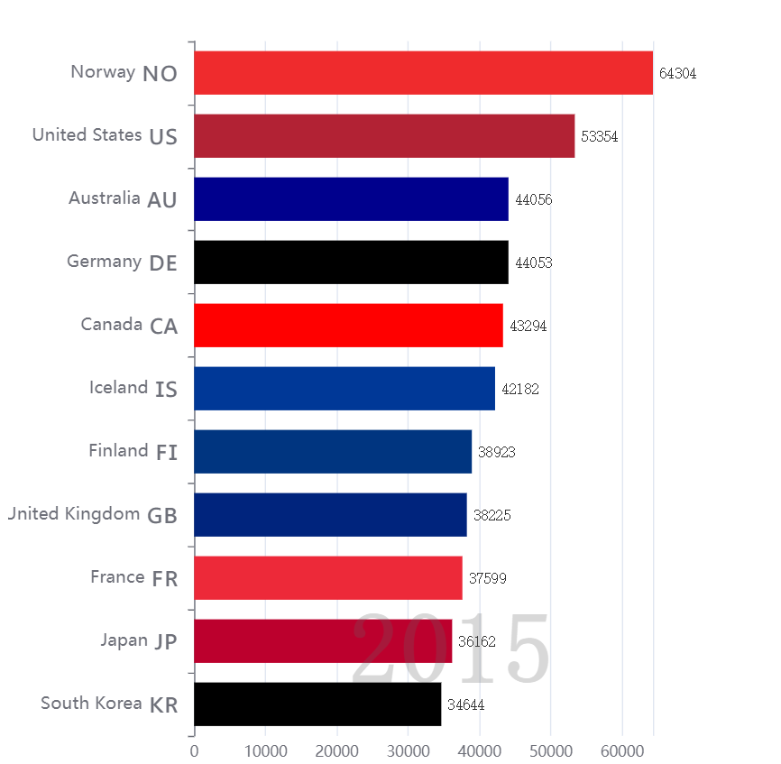

引入库和主题
============

```html
<!-- 1.引入echarts库 -->
<script src="echarts.min.js"></script>

<!-- 附加.引入主题 -->
<script src="shine.js"></script>

<!-- 引入jquery库 -->
<script src="./jquery.min.js"></script>
```

新建容器
========

```html
<div id="bar3" style="width: 800px;height:600px"></div>
	<script>
        const bar3 = {
            showchart: function(){
                // echarts图表代码
            }
        }
        bar3.showchart()  # 调用对象的showchart()方法
    </script>
```


在echarts示例中找一个图形
=========================

复制源码，粘贴在function中

修改ID和主题
============


下载外部数据
============

根据请求地址，访问并复制全部数据
--------------------------------


将json格式数据保存到本地文件中
------------------------------


修改请求地址为本地路径
----------------------


安装Live Server并运行
=====================


效果图和完整代码
================



```html
<!DOCTYPE html>
<html lang="en">

<head>
    <meta charset="UTF-8">
    <meta http-equiv="X-UA-Compatible" content="IE=edge">
    <meta name="viewport" content="width=device-width, initial-scale=1.0">
    <!-- 1.引入echarts库 -->
    <script src="echarts.min.js"></script>
    <!-- 附加.引入主题 -->
    <script src="shine.js"></script>

    <!-- 引入jquery库 -->
    <script src="./jquery.min.js"></script>
    <title>Document</title>
</head>

<body>
    <!-- 3.新建一个元素或容器(div) -->
    <div id="bar3" style="width: 600px; height: 600px; display: inline-block;"></div>
    <script>
        const bar3 = {
            showchart: function () {
                var chartDom = document.getElementById('bar3');
                var myChart = echarts.init(chartDom, 'shine');
                var option;

                const updateFrequency = 2000;
                const dimension = 0;
                const countryColors = {
                    Australia: '#00008b',
                    Canada: '#f00',
                    China: '#ffde00',
                    Cuba: '#002a8f',
                    Finland: '#003580',
                    France: '#ed2939',
                    Germany: '#000',
                    Iceland: '#003897',
                    India: '#f93',
                    Japan: '#bc002d',
                    'North Korea': '#024fa2',
                    'South Korea': '#000',
                    'New Zealand': '#00247d',
                    Norway: '#ef2b2d',
                    Poland: '#dc143c',
                    Russia: '#d52b1e',
                    Turkey: '#e30a17',
                    'United Kingdom': '#00247d',
                    'United States': '#b22234'
                };
                $.when(
                    $.getJSON('./data1.json'),
                    $.getJSON('./data2.json')
                ).done(function (res0, res1) {
                    const flags = res0[0];
                    const data = res1[0];
                    const years = [];
                    for (let i = 0; i < data.length; ++i) {
                        if (years.length === 0 || years[years.length - 1] !== data[i][4]) {
                            years.push(data[i][4]);
                        }
                    }
                    function getFlag(countryName) {
                        if (!countryName) {
                            return '';
                        }
                        return (
                            flags.find(function (item) {
                                return item.name === countryName;
                            }) || {}
                        ).emoji;
                    }
                    let startIndex = 10;
                    let startYear = years[startIndex];
                    option = {
                        grid: {
                            top: 10,
                            bottom: 30,
                            left: 150,
                            right: 80
                        },
                        xAxis: {
                            max: 'dataMax',
                            axisLabel: {
                                formatter: function (n) {
                                    return Math.round(n) + '';
                                }
                            }
                        },
                        dataset: {
                            source: data.slice(1).filter(function (d) {
                                return d[4] === startYear;
                            })
                        },
                        yAxis: {
                            type: 'category',
                            inverse: true,
                            max: 10,
                            axisLabel: {
                                show: true,
                                fontSize: 14,
                                formatter: function (value) {
                                    return value + '{flag|' + getFlag(value) + '}';
                                },
                                rich: {
                                    flag: {
                                        fontSize: 25,
                                        padding: 5
                                    }
                                }
                            },
                            animationDuration: 300,
                            animationDurationUpdate: 300
                        },
                        series: [
                            {
                                realtimeSort: true,
                                seriesLayoutBy: 'column',
                                type: 'bar',
                                itemStyle: {
                                    color: function (param) {
                                        return countryColors[param.value[3]] || '#5470c6';
                                    }
                                },
                                encode: {
                                    x: dimension,
                                    y: 3
                                },
                                label: {
                                    show: true,
                                    precision: 1,
                                    position: 'right',
                                    valueAnimation: true,
                                    fontFamily: 'monospace'
                                }
                            }
                        ],
                        // Disable init animation.
                        animationDuration: 0,
                        animationDurationUpdate: updateFrequency,
                        animationEasing: 'linear',
                        animationEasingUpdate: 'linear',
                        graphic: {
                            elements: [
                                {
                                    type: 'text',
                                    right: 160,
                                    bottom: 60,
                                    style: {
                                        text: startYear,
                                        font: 'bolder 80px monospace',
                                        fill: 'rgba(100, 100, 100, 0.25)'
                                    },
                                    z: 100
                                }
                            ]
                        }
                    };
                    // console.log(option);
                    myChart.setOption(option);
                    for (let i = startIndex; i < years.length - 1; ++i) {
                        (function (i) {
                            setTimeout(function () {
                                updateYear(years[i + 1]);
                            }, (i - startIndex) * updateFrequency);
                        })(i);
                    }
                    function updateYear(year) {
                        let source = data.slice(1).filter(function (d) {
                            return d[4] === year;
                        });
                        option.series[0].data = source;
                        option.graphic.elements[0].style.text = year;
                        myChart.setOption(option);
                    }
                });

                option && myChart.setOption(option);
            }
        }
        bar3.showchart()
    </script>


</body>

</html>
```

