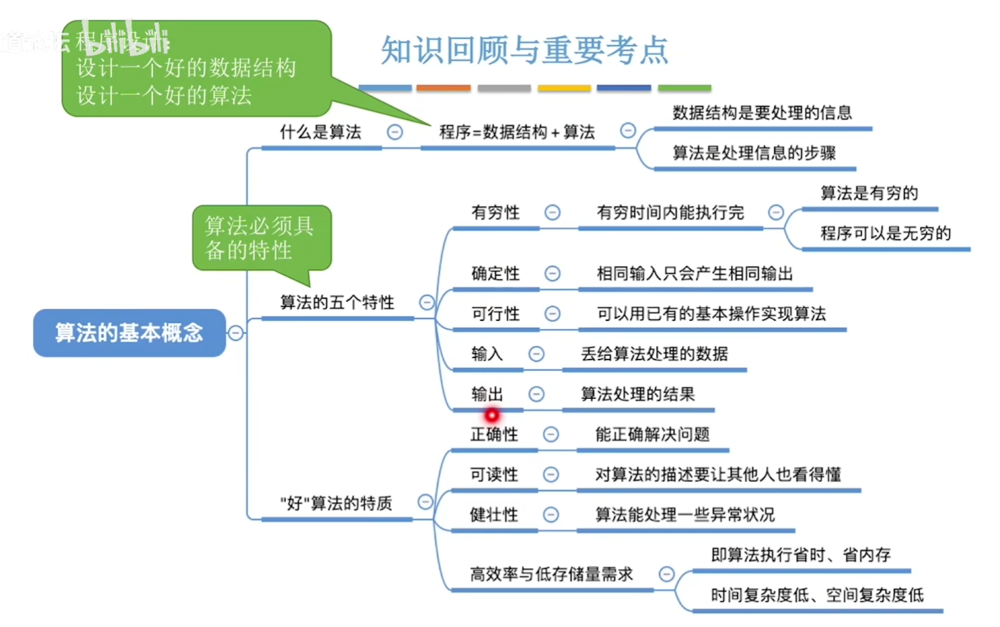

数据结构
========

#### 基本概念

​	数据

​	数据元素、数据项

​	数据对象、数据结构

​	数据类型、抽象数据类型

#### 数据结构三要素：

​	逻辑结构：集合、线性结构、树形结构、网状结构

​	物理结构（存储结构）：顺序存储、链式存储、索引存储、散列存储

​	数据的运算 

#### 算法

​	有穷性——算法执行有穷步之后结束

​	确定性——相同的输入只能得出相同的输出

​	可行性——通过基本运算执行有限次来实现

​	输入——0个或多个输入

​	输出——1个或多个输出

##### 	好的算法

​	正确性，可读性，健壮性，高效率与低存储量需求

#### 算法的效率

时间复杂度

空间复杂度