第一章
======

计算机硬件基本组成
------------------

### 冯诺依曼结构

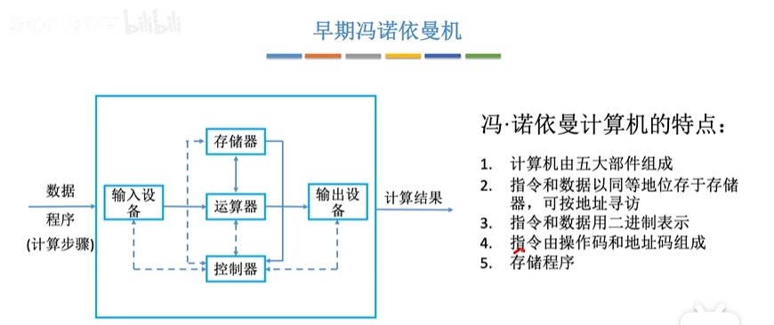

以运算器是核心中心

输入设备、输出设备、运算器、存储器、控制器 ——五大部件

I/O表示输入输出设备

### 现代计算机结构

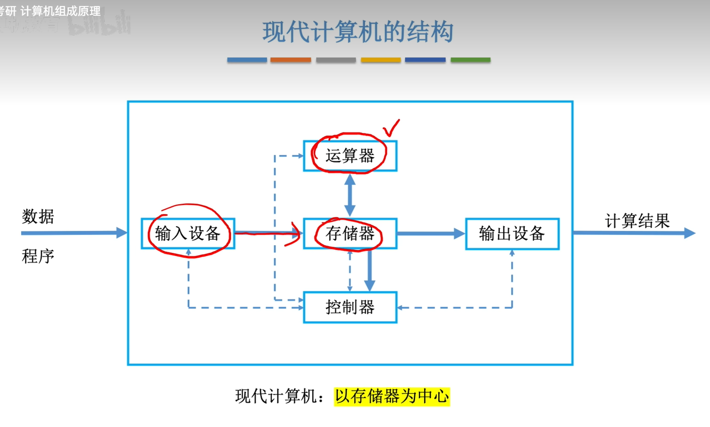

由于运算器和控制器之间关系十分紧密，现在把运算器和控制器集成到CPU中

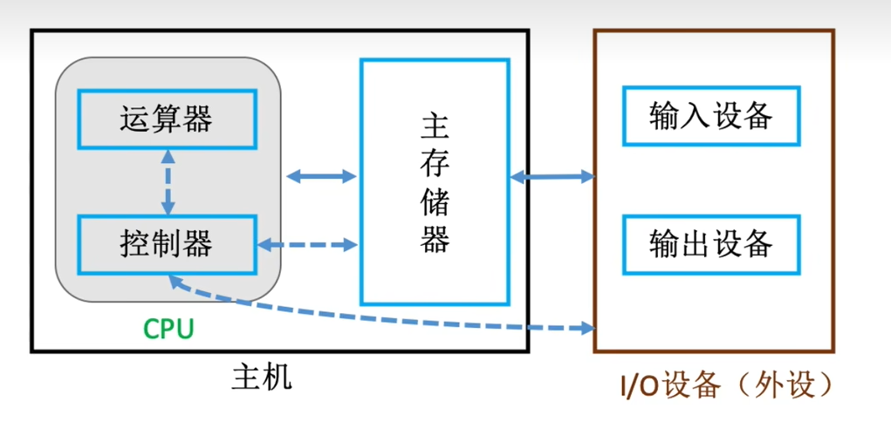

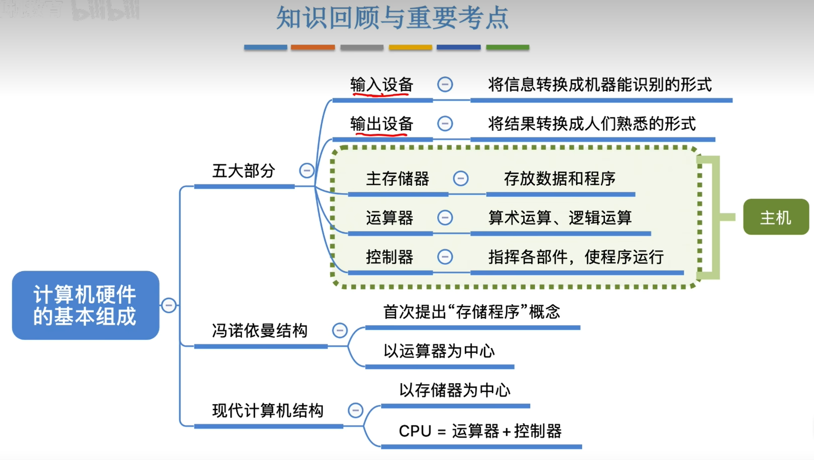

各个硬件工作原理
----------------

### 主存储器

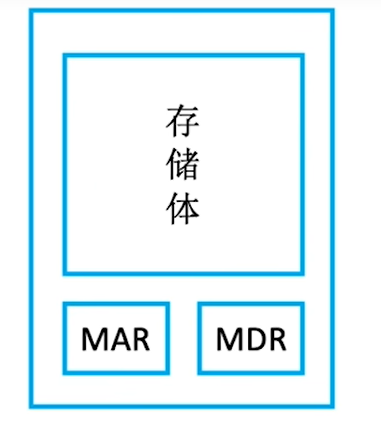

MAR 地址寄存器 指向地址。MAR位数，反应了存储单元的个数。

MDR 数据寄存器 

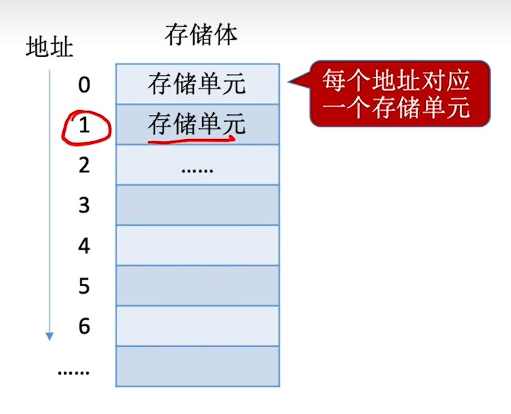

存储字长，存储单元二进制位数。= MDR的二进制位数

### 运算器

实现算术运算和逻辑运算

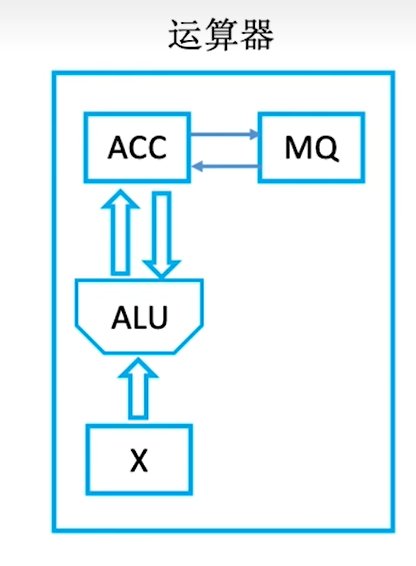

### 控制器

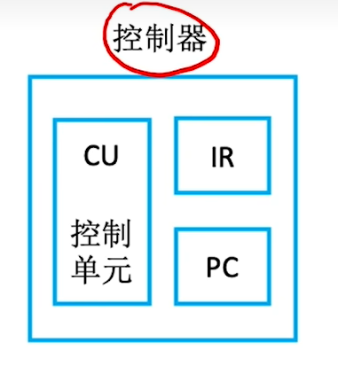

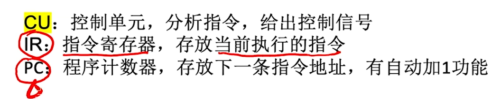

核心部件是CU

PC（取指令）->  IR（分析指令）->  CU（执行指令）

### 计算机工作过程

OP操作码  AD地址码

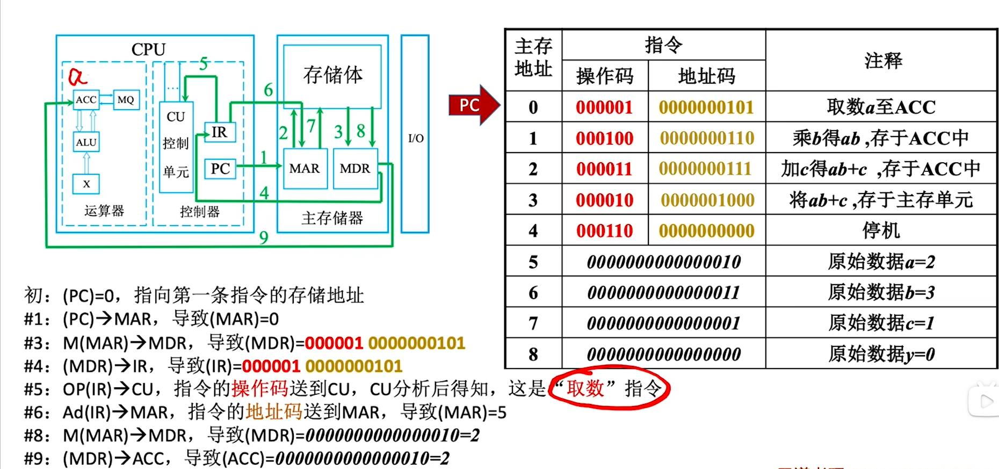

  

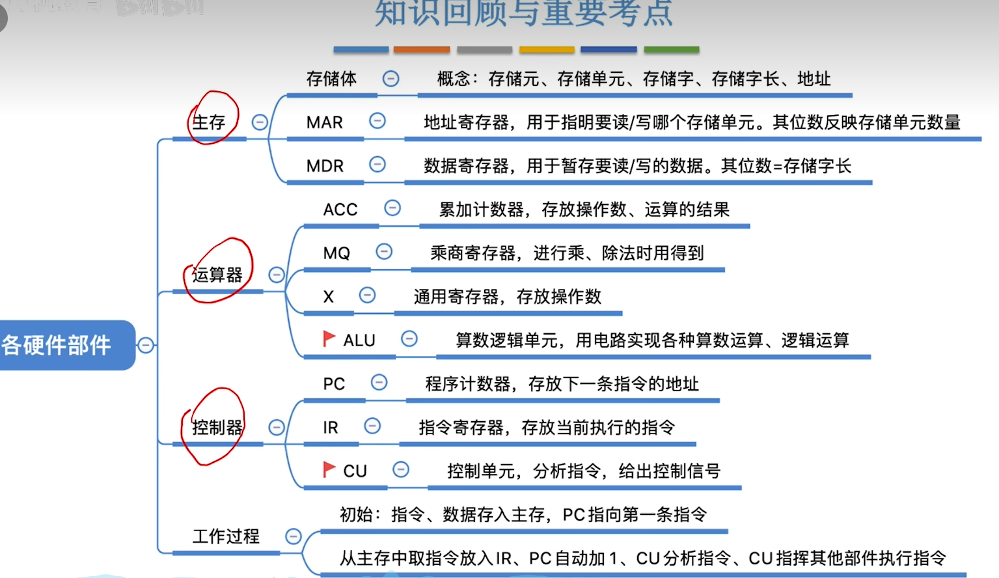

多级层次结构
------------

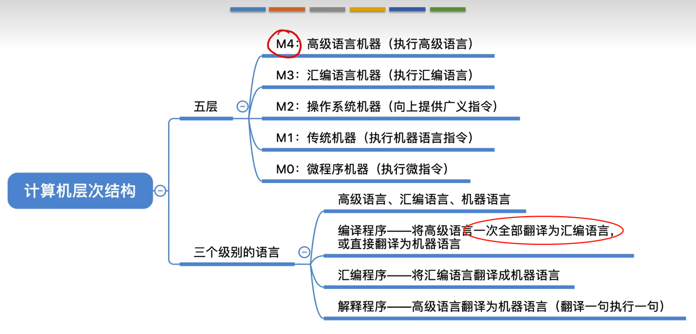

计算机性能指标
--------------

### 存储器性能指标

总容量 = 存储单元个数 × 存储字长 bit  =  存储单元个数 × 存储字长/8  Byte

例：MAR为32位，MDR为8位。
$$
总容量 = 2^{32}  * 8 bit = 4 GB
$$

### CPU性能指标

CPU主频（时钟频率）=1/CPU时钟周期

CPI 执行一条指令所需时钟周期数（一般求平均CPI）

IPS 每秒执行多少条指令 = 主频/平均CPI

FLOPS 每秒执行多少次浮点运算

### 系统整体性能指标

数据通路带宽：数据总线一次能并行传送信息位数

吞吐量：系统单位时间内处理请求的数量。系统吞吐量主要取决于主存的存取周期

 响应时间：用户发起请求到系统做出响应并获得结果的等待时间

基准程序：用于测量计算机处理速度的实用程序，可以与运行相同程序的其他计算机比较

第二章
======

进位计数制
----------

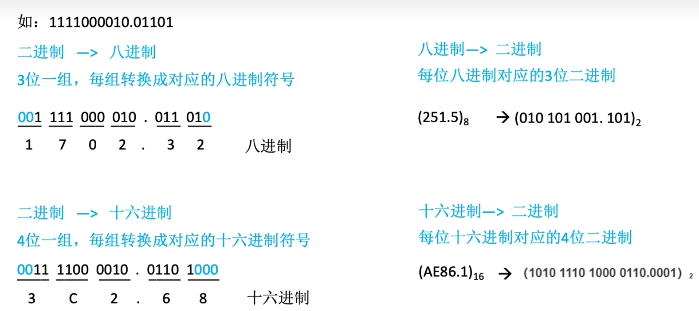

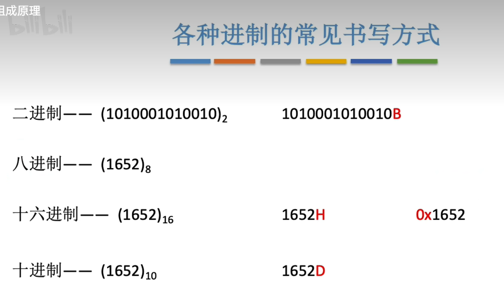

BCD码
-----

### 8421码

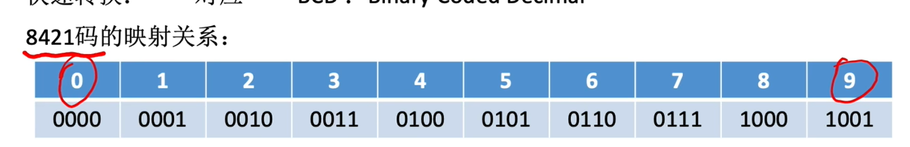

### 余3码

8421+（0011）

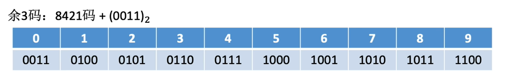

### 2421码

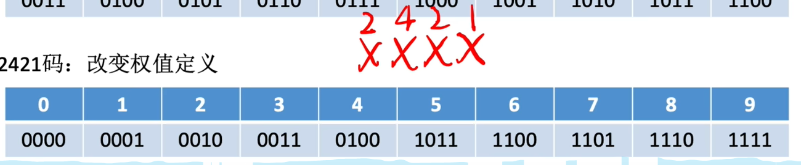

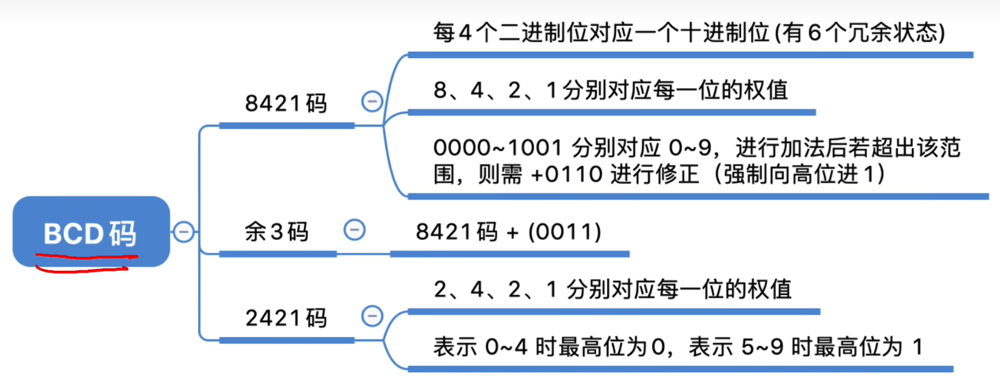

无符号整数的表示和运算
----------------------

无符号整数，即自然数

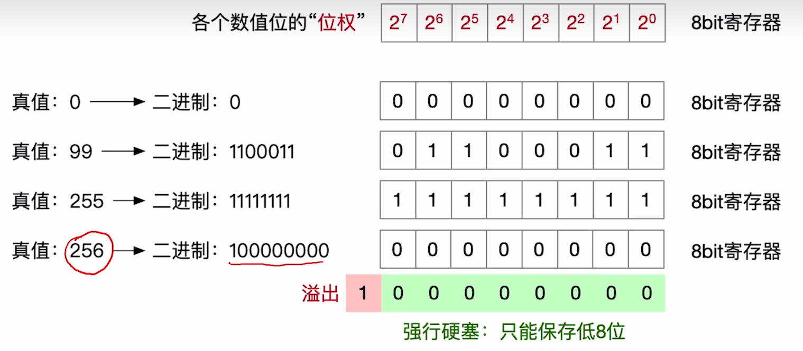

加法：从最低位开始，按位相加，并往更高进位

减法

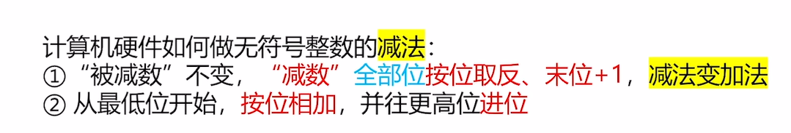

带符号整数的表示和运算
----------------------

### 原码

正数：首位0

负数：首位1

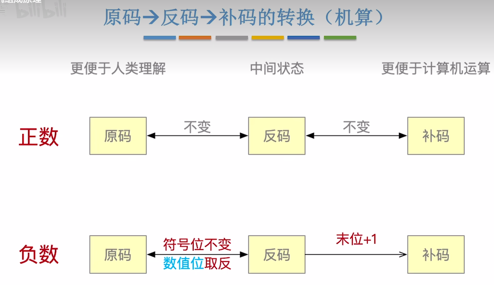

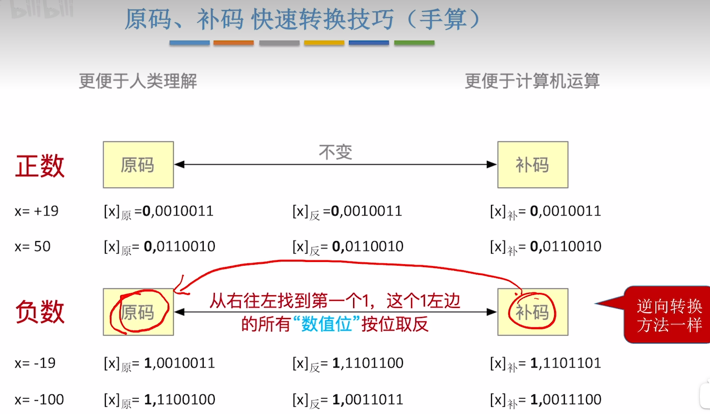

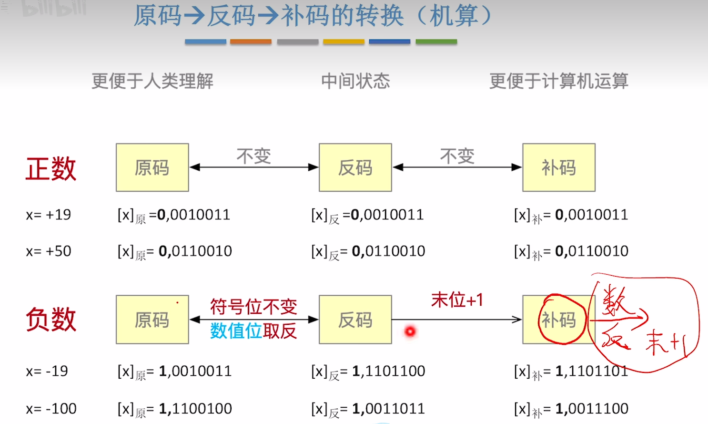

补码->原码（机算）：符号位不变，数值位取反，末位+1————同原码转补码

### 反码

### 补码

