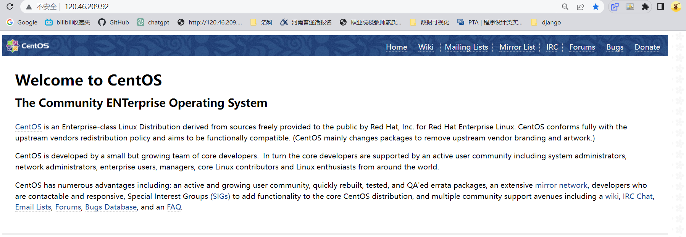
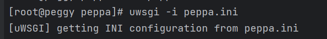
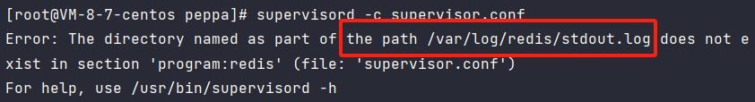

centos7.8 部署 Django项目
===========================

环境
----

- centos 7.8
- nginx 1.20.1
- django 3.2
- uwsgi 2.0.21
- python 3.9.7 
- mysql 5.7
- redis 
	- django-redis
	- django-redis-cache
- supervisor

## 安装python3.9.7

```txt
ssh root@120.46.209.92
dadishen0022.
yum -y install zlib-devel python-devel gcc libffi-devel tk-devel libpcap-devel bzip2-devel db4-devel xz-devel openssl-devel ncurses-devel patch readline-devel gdbm-devel sqlite-devel mailcap gcc mysql-devel gcc gcc-devel python-devel tcl


wget http://npm.taobao.org/mirrors/python/3.9.7/Python-3.9.7.tgz
tar -zxvf  Python-3.9.7.tgz

cd Python-3.9.7
./configure --prefix=/usr/local/python3/python39/
# 如果报错  yum install gcc

make && make install

#添加python软连接
ln -sf /usr/local/python3/python39/bin/python3.9 /usr/bin/python3
ln -sf /usr/local/python3/python39/bin/pip3.9 /usr/bin/pip3
```

```
# pip换源
mkdir /root/.pip   #创建文件夹
cd /root/.pip        #进入目录
vim pip.conf        #编辑配置文件

[global]
trusted-host = mirrors.aliyun.com
index-url = https://mirrors.aliyun.com/pypi/simple 
```


安装nginx
---------

```
## 1.yum方式安装nginx
yum -y install nginx
 
## 2.查看nginx版本
nginx -v
 
## 3.启动nginx
systemctl status nginx  ## 查看nginx状态
 
systemctl start nginx   ## 开启nginx服务
 
systemctl stop nginx     ## 关闭nginx服务
```

如果nginx运行正常，地址栏：120.46.209.92    62.234.1.22显示



Mysql安装
---------

```
yum -y install wget  #如果已有wget则不需要再安装
wget https://dev.mysql.com/get/mysql57-community-release-el7-8.noarch.rpm
rpm -ivh mysql57-community-release-el7-8.noarch.rpm


cd /etc/yum.repos.d/
rpm --import https://repo.mysql.com/RPM-GPG-KEY-mysql-2022
yum -y install mysql-server  #安装MySQL服务 需要一段时间


systemctl start mysqld  #启动mysql服务


grep 'temporary password' /var/log/mysqld.log  #获取临时密码z4XyyJ=v4>Lt lg#!qetjD4sp  732mcmeTyk,


mysql -u root -p #进行登录
alter user 'root'@'localhost' identified by 'Dadishen0022.';  #修改密码


#允许远程访问
use mysql;
update user set host = '%' where user = 'root';
flush privileges;
```

**如果无法获取临时密码**

```
#关闭Mysql 服务
service mysql stop

#修改
vi /etc/my.cnf
#在[mysqld]下加入一句话
skip-grant-tables    #可以跳过输入mysql登录密码

#进入mysql
use mysql;
update mysql.user set authentication_string=password('新密码') where user='root';
#mysql 8.0 改密码
ALTER USER 'root'@'localhost' IDENTIFIED WITH mysql_native_password BY "markjun";

flush privileges;
exit;

#把 /etc/my.cnf 文件中加入的那句话用#注释掉
```


上传django项目
--------------

上传成功以后

```python
# 生成依赖文件
pip3 freeze > requirements.txt
# 安装依赖包
pip3 install -r requirements.txt 
```


```
#如果没有mysqlclient
pip3 install mysqlclient
# 如果安装mysqlclient报错
yum install mysql-devel gcc gcc-devel python-devel
```

尝试启动runserver

```
python3 manage.py runserver 0.0.0.0:8000
IP地址:8000  # 120.46.209.92:8000
# 显示这个启动成功
```


uwsgi安装与配置
---------------

```
## 1.安装uwsgi
pip3 install uwsgi
 
## 2.建立软链接
ln -s /usr/local/python3/python39/bin/uwsgi /usr/bin/uwsgi
 
## 3.查看uwsgi版本
uwsgi --version
```

在settings.py所在目录 新建文件——项目名称.ini

在settings.py同一目录下

```
[uwsgi]
master=true
chdir=/www/wwwroot/job
module=job.wsgi
py-autoreload=1
lazy-apps=true

# 使用Nginx连接时使用，Django程序所在服务器地址（docker + nginx uwsgi_pass 127.0.0.1:8000; include uwsgi_params; 只能通过nginx转发才能访问）
# socket=0.0.0.0:8000
# 直接做web服务器使用，Django程序所在服务器地址(proxy_pass http://127.0.0.1:8000;nginx转发端口和直接宿主机ip端口都可以访问)
# http=0.0.0.0:8000
# 不需要在uWSGI配置中同时使用http和socket参数。如果你计划使用宿主机上的Nginx作为反向代理服务器，你只需要监听HTTP请求即可，无需在uWSGI配置中指定socket。

# socket=0.0.0.0:8010
http=0.0.0.0:8010
processes=4
buffer-size=32768
daemonize=uwsgi.log
log-maxsize = 50000000
vacuum = true
disable-logging = true
```


```


## 在当前目录启动
uwsgi -i 项目名称.ini    

## 如果 要关闭uwsgi     pkill -f uwsgi -9 
```



```
 ## 启动之后查看进程
ps -ef | grep uwsgi
```


```
查看日志,服务启动正常
tail -20f uwsgi.log
```


配置nginx
---------

vim /etc/nginx/nginx.conf    也可以修改完再上传覆盖原文件

```
user nginx;
worker_processes auto;
error_log /var/log/nginx/error.log;
pid /run/nginx.pid;
 
# Load dynamic modules. See /usr/share/doc/nginx/README.dynamic.
include /usr/share/nginx/modules/*.conf;
 
events {
    worker_connections  4096;
}
http {
    include       mime.types;
    default_type  application/octet-stream;
    sendfile        on;
	# 开启 Keep-Alive 连接，设置保持连接的时间
    keepalive_timeout 30s;

	# 配置缓存路径和参数
    proxy_cache_path /home/cache levels=1:2 keys_zone=my_cache:10m max_size=10g inactive=60m;
    proxy_cache my_cache;
    proxy_cache_valid any 5m;

    server {     # 主要修改部分  server中
        listen 80;
        charset utf-8;

        location /static/ {
		proxy_cache my_cache;
            proxy_cache_lock on;
            proxy_cache_lock_age 5s;
            proxy_cache_lock_timeout 10s;
               alias /www/wwwroot/peppa/static/;
        }

        location / {
            include uwsgi_params;
            uwsgi_pass 127.0.0.1:8000;
        }

location /xgsx/ {
		proxy_cache my_cache;
            proxy_cache_lock on;
            proxy_cache_lock_age 5s;
            proxy_cache_lock_timeout 10s;

            include uwsgi_params;
            uwsgi_pass 127.0.0.1:8001;
        }

location /xgsx/static/ {
            include uwsgi_params;
            alias /www/wwwroot/job/static/;
        }
    }
}
```


```
## 1.测试配置文件是否正确
nginx -t
## 2.启动nginx
nginx -c /etc/nginx/nginx.conf
```


```
## 3.软加载nginx
nginx -s  reload

pkill -f nginx -9  # 强制关闭nginx
```


静态文件
--------


配置完成
--------

django项目静态文件未设置！！！！


备注
----

```
## 之后项目重启只需要重启uwsgi之后再重启nginx即可，
## 项目重启
killall -9  uwsgi  或者  pkill -f uwsgi -9
uwsgi -i 项目名称.ini   uwsgi -i job.ini

pkill -f nginx -9 
nginx -c /etc/nginx/nginx.conf
nginx -s reload
 
## 切记正式环境要关掉django的debug模式，防止报错源码被看到。
## 关闭项目debug模式
settings.py文件中
debug = Fasle
```

supervisor守护进程
------------------

```
## 系统环境下
pip3 install supervisor
```

```
ln -s /usr/local/python3/python39/bin/echo_supervisord_conf /usr/bin/echo_supervisord_conf
echo_supervisord_conf > /etc/supervisord.conf
```


```
## 在当前项目下创建一个名为supervisor.conf的配置文件：

[program:redis]
command=redis-server /usr/local/src/redis-7.0.2/redis.conf
autostart=true
autorestart=true
startsecs=0
user=root
stdout_logfile=/var/log/redis/stdout.log
stderr_logfile=/var/log/redis/stderr.log


# supervisor的程序名字   [program:程序名]
[program:peppa]

# supervisor执行的命令，注意这里的配置文件名称要与之前创建的一致
command=uwsgi --ini peppa.ini

# 项目的目录(绝对路径)
directory = /www/wwwroot/peppa/peppa

# 开始的时等待多少秒
startsecs=0
# 停止的时等待多少秒
stopwaitsecs=0

# 自动开始
autostart=true
# 程序中断后自动重启
autorestart=true

# 配置日志文件(项目路径)
stdout_logfile=/www/wwwroot/peppa/supervisord.log
stderr_logfile=/www/wwwroot/peppa/supervisord.err

# 设置日志的级别
[supervisord]
loglevel=info

# 配置supervisor服务器
[inet_http_server]
port = :9001
# 用户名和密码
username = root
password = 007741ak

# 配置supervisorctl，使用supervisorctl的ip和端口
[supervisorctl]
serverurl = http://120.46.209.92:9001
# 配置supervisorctl的用户名和密码
username = admin
password = 007741ak

[rpcinterface:supervisor]
supervisor.rpcinterface_factory=supervisor.rpcinterface:make_main_rpcinterface
```

```
## 配置supervisord和supervisorctl软连接
ln -s /usr/local/python3/python39/bin/supervisord /usr/bin/supervisord
ln -s /usr/local/python3/python39/bin/supervisorctl /usr/bin/supervisorctl

## 启动supervisor(在supervisor.conf)
supervisord -c supervisor.conf
##启动supervisor命令行模式
supervisorctl -c supervisor.conf
#需要输入supervisor服务器的用户名和密码

进入命令行后，常用命令：
    # 查看状态
    status 

    # 启动               
    start 这里填你的项目名   

    # 重启
    restart 这里填你的项目名  

    # 关闭项目
    stop 这里填你的项目名  

    # 关闭所有  
    stop all  

    # 重新加载配置文件
    reload    
  
    # 停止 supervisord
    shutdown         

    # 退出  
	quit      
```


Redis安装
---------

```
yum install -y gcc tcl

cd /usr/local/src 

wget https://download.redis.io/releases/redis-7.0.2.tar.gz
tar -xzf redis-7.0.2.tar.gz  # 解压

cd redis-7.0.2
make && make install  # 默认安装在/usr/local/bin目录
```

```
redis-cli：是redis提供的命令行客户端
redis-server：是redis的服务端启动脚本
redis-sentinel：是redis的哨兵启动脚本
```

### 启动方式一——测试启动

```
redis-server
# 这种启动属于前台启动，会阻塞整个会话窗口，窗口关闭或者按下CTRL + C则Redis停止。不推荐使用。
```

### 配置redis.conf

```
# 修改redis.conf配置
vi /usr/local/src/redis-7.0.2/redis.conf

## 修改下面参数
```

```
# bind 127.0.0.1 -::1     注释掉，然后加上下面这行
bind 0.0.0.0    # 允许所有地址访问（不安全，后期可以改为其他地址）

requirepass 密码  # 设置redis密码 007741ak

protected-mode no  # 保护模式设置为no
```

```
# 重启redis-server，并带redis.conf配置启动
redis-server /usr/local/src/redis-7.0.2/redis.conf
```

### 启动方式二——后台启动

```
# 修改redis.conf配置
vi /usr/local/src/redis-7.0.2/redis.conf

## 修改下面参数
daemonize no  # 守护进程修改为no
```

```
# 在1.10中的supervisor.conf中加入下面配置

[program:redis]
command=redis-server /usr/local/src/redis-7.0.2/redis.conf
autostart=true
autorestart=true
startsecs=0
user=root
stdout_logfile=/var/log/redis/stdout.log
stderr_logfile=/var/log/redis/stderr.log
```

**如果目录不存在，则在/var/log/下新建一个redis目录**




```
# 在supervisorctl重新加载配置文件

supervisorctl
reload
start redis
status
```


drf 使用jwt    自定义 用户表（姓名，学号，不要密码，权限） ，  权限有教师账户和学生账户，登陆验证学号和姓名是否匹

1   181   809               25一下

2   303         846                      25-60 

3    191     307          60上     

```
## 在当前项目下创建一个名为supervisor.conf的配置文件：

[program:redis]
command=redis-server /usr/local/src/redis-7.0.2/redis.conf
autostart=true
autorestart=true
startsecs=0
user=root
stdout_logfile=/var/log/redis/stdout.log
stderr_logfile=/var/log/redis/stderr.log


# supervisor的程序名字   [program:程序名]
[program:peppa]

# supervisor执行的命令，注意这里的配置文件名称要与之前创建的一致
command=uwsgi --ini peppa.ini

# 项目的目录(绝对路径)
directory = /www/wwwroot/peppa/peppa

# 开始的时等待多少秒
startsecs=0
# 停止的时等待多少秒
stopwaitsecs=0
user=root
# 自动开始
autostart=true
# 程序中断后自动重启
autorestart=true

# 配置日志文件(项目路径)
stdout_logfile=/www/wwwroot/peppa/supervisord.log
stderr_logfile=/www/wwwroot/peppa/supervisord.err


# supervisor的程序名字   [program:程序名]
[program:job]

# supervisor执行的命令，注意这里的配置文件名称要与之前创建的一致
command=uwsgi --ini job.ini

# 项目的目录(绝对路径)
directory = /www/wwwroot/job/job

# 开始的时等待多少秒
startsecs=0
# 停止的时等待多少秒
stopwaitsecs=0
user=root
# 自动开始
autostart=true
# 程序中断后自动重启
autorestart=true

# 配置日志文件(项目路径)
stdout_logfile=/www/wwwroot/job/supervisord.log
stderr_logfile=/www/wwwroot/job/supervisord.err


# 设置日志的级别
[supervisord]
loglevel=info

# 配置supervisor服务器
[inet_http_server]
port = :9001
# 用户名和密码
username = root
password = 007741ak

# 配置supervisorctl，使用supervisorctl的ip和端口
[supervisorctl]
serverurl = http://120.46.209.92:9001
# 配置supervisorctl的用户名和密码
username = admin
password = 007741ak

[rpcinterface:supervisor]
supervisor.rpcinterface_factory=supervisor.rpcinterface:make_main_rpcinterface
```


