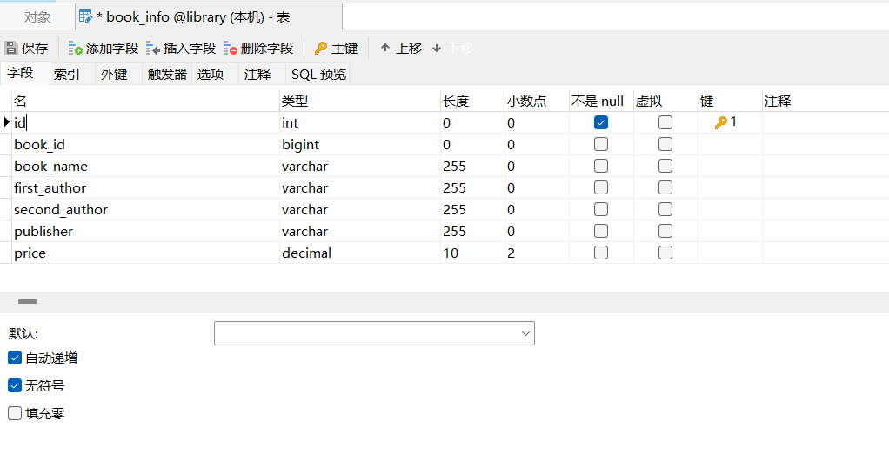
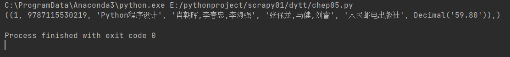
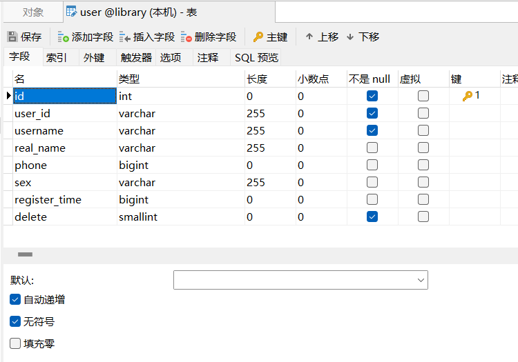

Class 01 
---------

### 新建项目

​	新建项目文件夹 library ， 文件夹下新建python文件 book_info.py文件


### 数据库

#### 	新建连接

​	打开Navicat ，新建本机连接，


#### 	新建数据库


#### 	新建表

​	新建图书信息表    book_info   ,列：

​		id , 主键，不是null，自动递增

​		book_id, 图书号，唯一，可以为空

​		book_name, 书名 ,字符集 ： utf8   utf8_general_ci

​		first_author, 主编 ,字符集 ： utf8   utf8_general_ci

​		second_author, 副编 ,字符集 ： utf8   utf8_general_ci

​		publisher , 出版社  ,字符集 ： utf8   utf8_general_ci

​		price, 价格 



### 连接数据库

#### 	安装pymysql

```python
#在终端输入，安装pymysql模块
pip install pymysql 
```

#### 	连接pymysql

```python
import pymysql #引入pymysql

#建立数据库连接
db = pymysql.connect(host='localhost',user='root',password='123456',database='library')
cursor = db.cursor()

#写sql语句
sql = 'SELECT * FROM book_info'
#提交sql语句
cursor.execute(sql)

#接收返回值
res = cursor.fetchall()    #接受所有的返回值
#res = cursor.fetchone()   #接收返回值中的第一条
print(res)

#关闭数据库连接
db.close()
```




### 	图书信息模块

#### 		整体结构

```python
import pymysql

while True:
    print('''
        1.查询图书信息
        2.新增图书信息
        3.修改图书信息
        4.删除图书信息
        5.搜索图书信息
        6.退出程序
    ''')
    option = input('请输入对应功能：')
	#建立数据库连接  
    db = pymysql.connect(host='localhost', user='root', password='123456', database='library')
    cursor = db.cursor()  #建立游标

    if option=='1':
        #查询功能
		pass

    elif option=='2':
        #新增功能
        pass

    elif option=='3':
        #修改功能
        pass

    elif option=='4':
        #删除功能
        pass

    elif option=='5':
        #搜索功能
        pass

    else :
        print('退出程序')
        break

    db.close()
```


#### 	查询功能

​	mysql查询语句

​	SELECT * FROM 表名              #查询全表

​	SELECT 列1,列2,列3 FROM 表名                #查询某列

​	SELECT 列1,列2,列3  FROM 表名  WHERE 列3=某个值               #条件查询

```python
sql = 'SELECT * FROM book_info'      #查询全表
cursor.execute(sql)
results = cursor.fetchall()

print('\n' + '*$' * 15)
print('书本ID\t书名\t主编\t副编\t出版社\t价格')
for result in results:
	print('{}\t{}\t{}\t{}\t{}\t¥{}\t'.format(result[1], result[2], result[3], result[4], result[5], result[6]))
print('*$' * 15 + '\n')
```


Class 02
--------

### 	图书信息模块

#### 函数

##### 创建函数

​		（定义函数、声明函数）

```python
def functionname(参数):
    函数体
    ...
    ...
```

##### 调用函数

```python
程序语句1
程序语句2
functionname()
程序语句3
```


#### 	新增功能

​	mysql插入语句

```sql
#插入一条数据
INSERT INTO 表名(列1,列2,列3) VALUE(整数,'字符串',浮点数)
INSERT INTO 表名 SET 列1=整数,列2='字符串',列3=浮点数
#插入多条数据
INSERT INTO 表名(列1,列2,列3) VALUES(整数,'字符串',浮点数),(整数,'字符串',浮点数),(整数,'字符串',浮点数)
```

​	写一个函数，新增功能

```python
def insert():
    book_id = int(input('请输入书本ID：'))
    book_name = input('请输入书名：')
    first_author = input('请输入主编：')
    second_author = input('请输入副编：')
    publisher = input('请输入出版社：')
    price = float(input('请输入价格：'))

    print('您要新增的图书信息为：', book_id, book_name, first_author, second_author, publisher, price)

    choice = input('确定录入请输入Y,放弃录入请输入N：')
    if choice == 'Y' or choice == 'y':
        sql = "INSERT INTO book_info(book_id,book_name,first_author,second_author,publisher,price) VALUES ({},'{}','{}','{}','{}',{})".format(
            book_id, book_name, first_author, second_author, publisher, price)
        cursor.execute(sql)
        db.commit()
        print('新增成功')
        time.sleep(2)
    
```


#### 	修改功能

​	mysql 更新语句

```sql
#更新一个字段的值
UPDATE 表名 SET 列1 = '你好'  WHERE  列2 = 123 

#更新多个字段的值
UPDATE 表名 SET 列1='abc',列2='efg'   WHERE  列3 = 123 
```


```python
def modify():
    book_id = int(input('请输入书本ID：'))

    # 查询数据库，检测书号是否存在
    sql = 'SELECT * FROM book_info where book_id=%s' % book_id
    cursor.execute(sql)
    result = cursor.fetchone()

    # 如果书号存在：
    if result:
        # 打印出准备修改的图书信息
        print('您要修改的图书为：')
        print('{}\t{}\t{}\t{}\t{}\t¥{}\t'.format(result[1], result[2], result[3], result[4], result[5], result[6]))

        # 接收新的图书信息（用于更新）
        book_name = input('请输入书名：')
        first_author = input('请输入主编：')
        second_author = input('请输入副编：')
        publisher = input('请输入出版社：')
        price = float(input('请输入价格：'))
        print('您要修改信息为：', book_id, book_name, first_author, second_author, publisher, price)

        # 根据用户选择，是否录入数据库
        choice = input('确定录入请输入Y,放弃录入请输入N：')
        if choice == 'Y' or choice == 'y':
            sql = "UPDATE book_info SET book_name='{}',first_author='{}',second_author='{}',publisher='{}',price={} WHERE book_id=%d;".format(
                book_name, first_author, second_author, publisher, price, book_id)
            cursor.execute(sql)
            db.commit()
            print('修改成功')

    # 如果书号不存在
    else:
        print('书号不存在,返回主页面')
    time.sleep(2)
```


#### 	删除功能

​	mysql 删除语句

```sql
#条件删除
DELETE FROM 表名 WHERE 列1=123456

#删除全表
DELETE FROM 表名
```


```python
def delete():
    book_id = int(input('请输入书本ID：'))

    # 查询数据库，检测书号是否存在
    sql = 'SELECT * FROM book_info where book_id=%d' % book_id
    cursor.execute(sql)
    result = cursor.fetchone()

    # 如果书号存在：
    if result:
        print('您要删除的图书为：')
        print('{}\t{}\t{}\t{}\t{}\t¥{}\t'.format(result[1], result[2], result[3], result[4], result[5], result[6]))
        choice = input('确定删除请输入Y,放弃删除请输入N：')

        # 根据用户选择，是否删除
        if choice == 'Y' or choice == 'y':
            sql = "DELETE FROM book_info WHERE book_id = %d" % book_id
            cursor.execute(sql)
            db.commit()
            print('删除成功')
    # 如果书号不存在，返回
    else:
        print('书号不存在')
    time.sleep(2)
```


Class 03
--------

### 图书信息模块

#### 	搜索功能

​	mysql 模糊查询  LIKE语句

```sql
#    %通配符，长度不限

# 匹配列1中 ， 以T开头的 值
SELECT * FROM 表名 WHERE 列1 LIKE 'T%'
# 匹配列1中 ， 以S结尾的 值
SELECT * FROM 表名 WHERE 列1 LIKE '%S'
# 匹配列1中 ， 包含abc的值
SELECT * FROM 表名 WHERE 列1 LIKE '%abc%'
# 匹配列1或列2中 ， 包含abc的值
SELECT * FROM 表名 WHERE 列1 LIKE '%abc%' OR 列2 LIKE '%abc%'
```


```sql
#    _通配符，长度为1

# 匹配列1中 ， 以a开头只有两个字符的 值
SELECT * FROM 表名 WHERE 列1 LIKE 'a_'
# 匹配列1中 ， 以S结尾只有两个字符的 值
SELECT * FROM 表名 WHERE 列1 LIKE '_S'
# 匹配列1中 ， 以a开头b结尾，一共有4个字符的 值
SELECT * FROM 表名 WHERE 列1 LIKE 'a__b'
```


```python
def search():
    # 模糊查询关键词
    key = input('\n    请输入关键词:')
    sql = "SELECT * FROM book_info WHERE book_name LIKE '%{}%' OR first_author LIKE '%{}%' OR publisher LIKE '%{}%' ".format(
        key, key, key)
    cursor.execute(sql)
    results = cursor.fetchall()

    # 打印出查询结果
    print('*$' * 15)
    if results:
        print('书本ID' + '\t' + '书名' + '\t' + '主编' + '\t' + '副编' + '\t' + '出版社' + '\t' + '价格')
        for result in results:
            print('{}\t{}\t{}\t{}\t{}\t¥{}\t'.format(result[1], result[2], result[3], result[4], result[5], result[6]))
    else:
        print('没有搜索到任何信息')
    print('*$' * 15)
    time.sleep(2)
```


### 用户模块

#### 新建用户表




#### 新建user.py

​	#整体结构

```python
import pymysql

while True:
    print('''
        1.查询所有用户
        2.新增用户
        3.修改用户
        4.删除用户
        5.搜索用户
        6.退出程序
    ''')
    option = input('请输入对应功能：')
	#建立数据库连接  
    db = pymysql.connect(host='localhost', user='root', password='123456', database='library')
    cursor = db.cursor()  #建立游标

    if option=='1':
        #查询功能
		pass

    elif option=='2':
        #新增功能
        pass

    elif option=='3':
        #修改功能
        pass

    elif option=='4':
        #删除功能
        pass

    elif option=='5':
        #搜索功能
        pass

    else :
        print('退出程序')
        break

    db.close()
```


Class 04
--------

### 用户模块

#### 	正则表达式

​	见《Python程序设计》 104-110页

​	

#### 	字符串切片

```python
str[起始位置:结束位置:步长]
#起始位置和结束位置可以为负数
```

​	

#### 	时间戳

​	时间戳是指格林威治时间1970年01月01日00时00分00秒(北京时间1970年01月01日08时00分00秒)起至现在的总秒数。

```python
import time
#获取当前时间戳
print(time.time())
print(int(time.time()))
```


#### 	随机数

```python
import random
random.random()                       #0-1之间随机数
random.randint(3,15)                  #3-15之间随机整数
random.uniform(3.2,20.6)              #两数之间随机浮点数
random.choice('ABCDEFG')              #从序列中随机选择一个
random.sample('abcdefghijklmn' , 5)   #从多个字符中生成指定数量的随机字符
```


#### 	新增功能

```python
# 正则匹配用户名
pattern1 = r'^[a-z0-9A-Z]{8,20}$'
match1 = re.match(pattern1,input('请输入8-20位字母数字用户名：'))
# 正则匹配手机号
pattern2 = r'^1[3|4|5|8|9]\d{9}$'
match2 = re.match(pattern2, input('请输入手机号码：'))

#如果用户名和手机号匹配成功
if match1 and match2:
	name = input('请输入名字：')
	sex = input('请输入性别：')
	# 算法生成user_id
	user_id = str(time.time())[1:10] + match2.string[-3:] + random.choice('ABCDEFGHTWMJK')
	timestamp = int(time.time())

	#写入数据库
	sql = "INSERT INTO user(user_id,username,real_name,phone,sex,register_time) VALUE ('{}','{}','{}',{},'{}',{})".format(user_id,match1.string,name, int(match2.string),sex,timestamp)
	cursor.execute(sql)
	db.commit()
	print('新增成功')

#用户名和手机号匹配不成功
else:
	print('请输入正确的用户名和密码')
```


Class 05
--------
