数据分析
========

### Numpy 和 Pandas

Numpy是基于C语言编写，比Python内置的list和set运算速度更快

用到矩阵计算，方便，快速

### Numpy 和 Pandas安装

```
pip3 install numpy scipy matplotlib pandas -i https://pypi.tuna.tsinghua.edu.cn/simple
```

​	#anaconda 虚拟环境带有numpy和pandas

Numpy
-----

### 1

#### 	打印np

```
array = np.array([[1,2,3],[4,5,6]])
#输出的np没有逗号
```


#### 	np的维度


#### 	np的形状（2行3列）


#### 	np的长度


### 2 基础

#### 	array赋值


#### 	生成全0和全1矩阵


#### 	empty#生成空矩阵，元素非常接近0


#### arange


​	#重新定义形状


#### linspace

​	#在1到10之间，分割 step - 1 段


### 3 

#### 	基础运算

​	

#### 	三角函数

​	sin(a)   cos(a)   tan(a)

#### 	判断运算


#### 	矩阵运算

```python
#矩阵中，对应位置的元素，逐个相乘
c= a*b   
#矩阵乘法
c_dot = np.dot(a,b)
#矩阵乘法
c_dot_2 = a.dot(b)
```

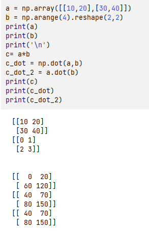

#### 随机生成

​	#随机生成2行4列的数字（0-1）之间

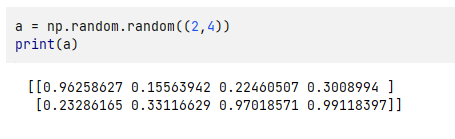

#### 计算

```python
print(np.sum(a))  #求和
print(np.max(a))  #最大值
print(np.min(a))  #最小值
```

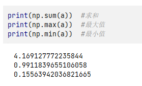

```python
#axis = 1 水平方向
#axis = 0 垂直方向

print(np.sum(a,axis=1))  #求和：每行求和
print(np.max(a,axis=0))  #最大值：每列最大值
print(np.min(a,axis=1))  #最小值：每列最小值
```

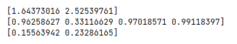

#### 索引1

```python
#返回最大值和最小值的索引
a = np.arange(2,14).reshape((3,4))
print(np.argmin(a))
print(np.argmax(a))
```

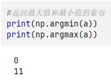

#### 平均值和中位数

```python
#计算矩阵平均值
a = np.arange(2,14).reshape((3,4))
print(np.mean(a))
print(a.mean())
print(np.average(a))
#print(a.average())这个不能用
```

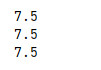


```python
#按行和列求平均值
a = np.arange(2,14).reshape((3,4))
print(a)
print(np.mean(a,axis=0)) #求列平均值
print(np.mean(a,axis=1)) #求行平均值
```


```python
#计算中位数
a = np.arange(2,14).reshape((3,4))
print(np.median(a))
```


#### 累加

```python
#累加   
print(a)
print('\n')
print(np.cumsum(a))
```

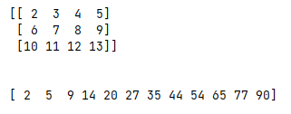

```python
#相邻两数差
a = np.arange(3,27,2).reshape((3,4))
print(a)
print('\n')
print(np.diff(a))
```

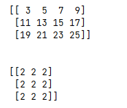

#### 输出非0

```python
#输出非0的坐标
#第一个数组是行，第二个数组是列
a = np.arange(3,27,2).reshape((3,4))
print(a)
print('\n')
print(np.nonzero(a))
```

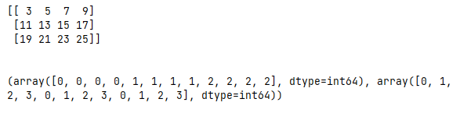

#### 排序

```python
#逐行排序
a = np.arange(27,3,-2).reshape((3,4))
print(a)
print('\n')
print(np.sort(a))
```

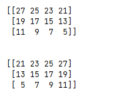

#### 转置

```python
#转置，行列转换			
a = np.arange(27,3,-2).reshape((3,4))
print(a)
print('\n')
print(np.transpose(a))
print(a.T)
```

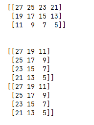

#### 截取

```python
#小于12全变为12，大于18全变为18
a = np.arange(25,1,-2).reshape((3,4))
print(a)
print('\n')
print(np.clip(a,12,18))
```


#### 索引2

```python
#取值
a = np.arange(3,15)
print(a)
print(a[3])
```

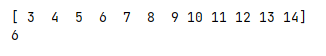

```python
#二维取值和列表相同
a = np.arange(3,15).reshape(3,4)
print(a)
print(a[1][2])
print(a[1,2])
```

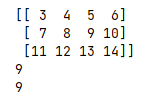

```python
print(a[1,:])   #1行 所有值
print(a[1,1:3])   #1行，第1-2
print(a[:,1:3])  #所有行，第1-2
print(a[:,::2])  #所有行，步长2
```

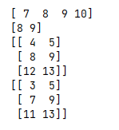

#### 遍历

```python
#遍历行
a = np.arange(3,15).reshape(3,4)
for row in a:
    print(row)
```

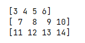

```python
#遍历列
a = np.arange(3,15).reshape(3,4)
for column in a.T:
    print(column)
```

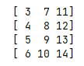

```python
#遍历各项
a = np.arange(3,15).reshape(3,4)
print(a)
print(a.flat)
print(a.flatten())
for item in a.flat:
    print(item)
```

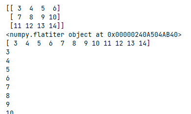

### 4

#### 合并

```python
a = np.array([1,1,1])
b = np.array([2,2,2])
print(np.vstack((a,b)))  #上下合并
print(np.hstack((a,b)))  #左右合并
```

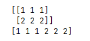

```python
#横向、纵向转换
a = np.array([1,1,1])
print(np.mat(a))
a = np.mat(a).T
print(a)
```

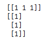

```python
a = np.array([1,1,1])[:,np.newaxis]
b = np.array([2,2,2])[:,np.newaxis]
#既可以横向也可以纵向
c = np.concatenate((a,a,b,a),axis=0)
print(c)
d = np.concatenate((a,a,b,a),axis=1)
print(d)
```

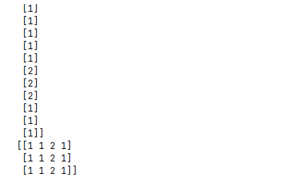

#### 分割

```python
a = np.arange(12).reshape(3,4)
print(a)
#  第二个参数，表示分割为几块,只能实现等量分割
print(np.split(a,2,axis=1))
#  第二个参数，表示分割为几块,可以实现不等量分割
print(np.array_split(a,3,axis=1))
#根据垂直和水平方向进行分割,只能实现等量分割
print(np.vsplit(a,3))
print(np.hsplit(a,2))
```

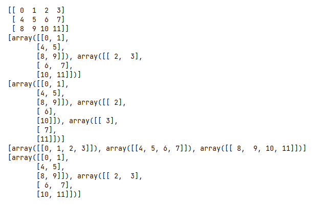

### 5

#### 赋值

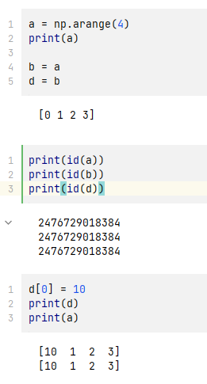

​			**所有变量都是指向同一地址。**


#### copy

```python
a = np.arange(4)
print(a)


b = a.copy()
print(id(a))
print(id(b))


b[0]=20
print(a)
print(b)
```

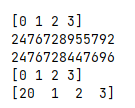

​			**使用copy，重新开辟地址并赋值**


pandas
------

### 1

#### 		Series

```
s = pd.Series([1,5,3,9,5.3])
print(s)
```

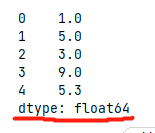

#### 	Dataframe

```python
df =pd.DataFrame(np.arange(24).reshape((4,6)))
print(df)
```

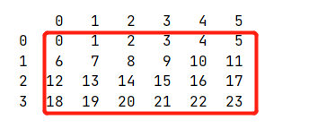

```python
df =pd.DataFrame({'A':1.,
                  'B':pd.Timestamp('20220405'),
                  'C':pd.Series(1,index=list(range(4))),
                  'D':np.array([3]*4,dtype='int32'),      
                  'E':pd.Categorical(['test','train','test','train']),
                  'F':'foo'
                  })
print(df)
```

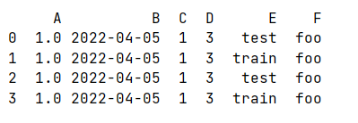

```python
df.dtypes
```

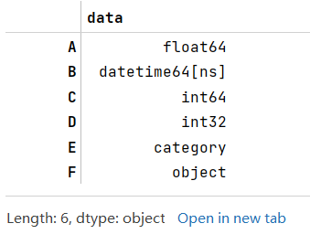

```python
#查看行
df.index
```

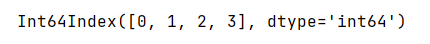

```python
#查看列
df.columns
```

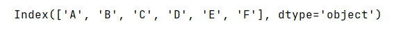

```python
#查看所有值
df.values
```

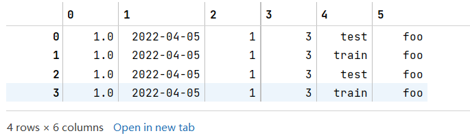

```python
#计算数字类型的列的 数量、平均值、方差等等
df.describe()
```

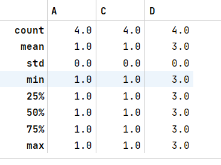

```python
#行列转置
df.T
```

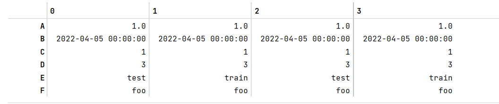


#### 	排序

```python
#排序  axis=0 根据列排序，ascending=False 倒序

df1 = df.sort_index(axis=1,ascending=False)
print(df1)
df2 = df.sort_index(axis=1,ascending=True)
print(df2)
```

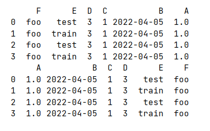

```python
df1 = df.sort_index(axis=0,ascending=False)
print(df1)
df2 = df.sort_index(axis=0,ascending=True)
print(df2)
```

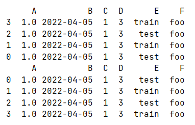

```python
#根据 列 的值进行排序
df.sort_values(by='E')
```

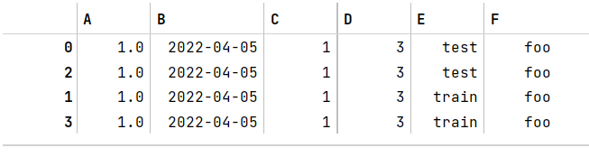


### 2

#### 	选择数据

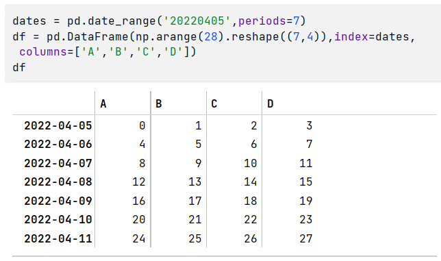

```python
#两种方法，调用某列
print(df['A'])
print(df.A)
```

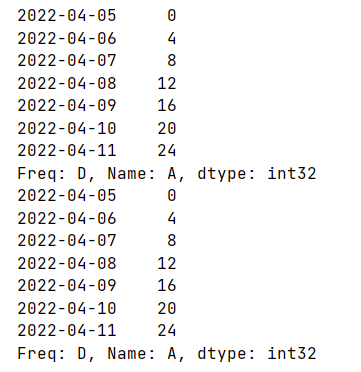

```python
#两种方法，选择行数据
print(df[0:3])
print(df['2022-04-06':'2022-04-09']) #前后都选择到
```

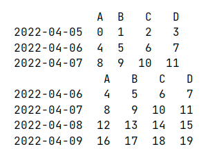

#### 	df.loc 

​	#根据lable进行筛选

```python
print(df.loc['20220407'])  #横向
print(df.loc['20220407',['A','B']])
```

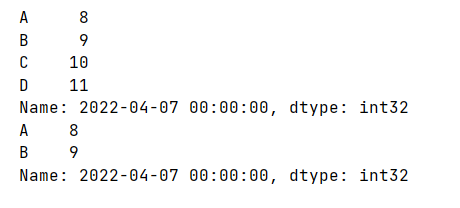

#### 	df.iloc

​	#根据position进行筛选

```python
print(df.iloc[3])  #第3行
print(df.iloc[3:5,1:3])  
```

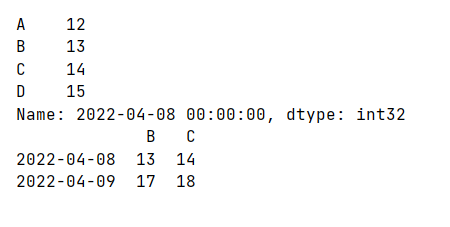

#### 	ix

​	#新pandas已经弃用ix


### 3

​	#示例df


#### 	

#### 	取值

```python
#整行赋值
df.iloc[2:3] = 666
df
```

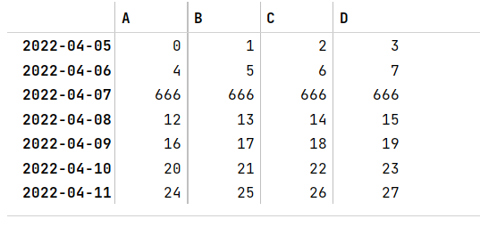


```python
#范围赋值
df.iloc[3:5,2] = 999
df
```

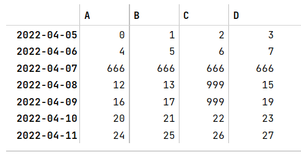


```python
#根据lable进行范围赋值
df.loc['20220409','D'] = 1234
df
```

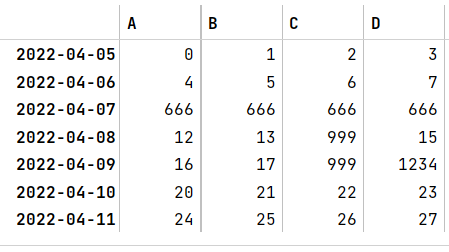


```python
df[df.A>16] = 0 #根据条件，修改所有的值
print(df)
df.C[df.A>12] = 3 #根据条件，修改某列的值
print(df)
```

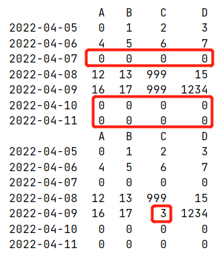


### 4

​	#示例df

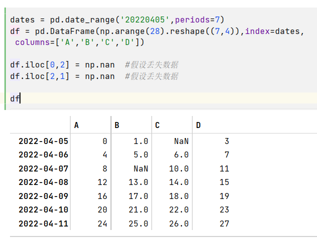

#### 	处理丢失数据

```python
# how={'any','all'}
# any行或列出现过任意NaN就丢掉
# all行或列所有值都是NaN才丢掉
# 出现NaN 丢掉行

df1 = df.dropna(axis=0,how='any')
print(df1)
df2 = df.dropna(axis=1,how='any')
print(df2)
```

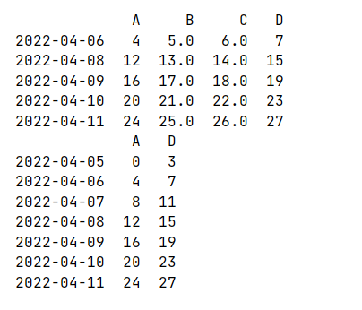

```python
#替换NaN为value
df3 = df.fillna(value=59)
df3
```

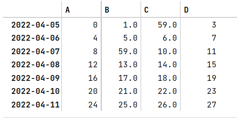

```python
#判断值是否为NaN
print(df.isnull())
```

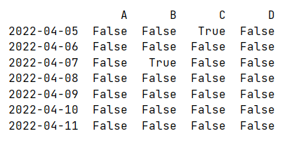

```python
#判断范围内是否有NaN
print(   np.any(df.isnull()) == True   )
```


### 5

#### 	读写CSV

```
data = pd.read_csv('path.csv') 

data.to_csv('path.csv')
```

​	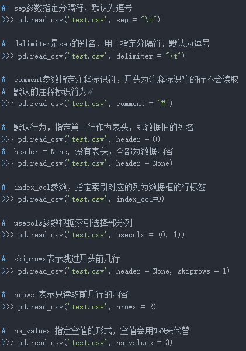

### 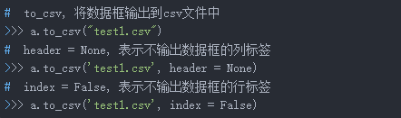


#### 	读写EXCEL

```
pd.read_excel('path.xlsx')

pd.to_excel('path.xlsx')
```


### 6

#### 	合并—concat

​	#示例DataFrame数据

```
df1 = pd.DataFrame(np.ones((3,4))*0,columns = ['a','b','c','d'])
df2 = pd.DataFrame(np.ones((3,4))*1,columns = ['a','b','c','d'])
df3 = pd.DataFrame(np.ones((3,4))*2,columns = ['a','b','c','d'])
print(df1)
print(df2)
print(df3)
```


```python
#垂直合并
res = pd.concat([df1,df2,df3],axis=0)
print(res)

#水平合并
res = pd.concat([df1,df2,df3],axis=1)
print(res)
```


```python
#垂直合并  忽略索引
res = pd.concat([df1,df2,df3],axis=0,ignore_index=True)
print(res)

#水平合并  忽略索引
res = pd.concat([df1,df2,df3],axis=1,ignore_index=True)
print(res)
```


#### 	join=

​	#示例DataFrame数据

```python
df1 = pd.DataFrame(np.ones((3,4))*0,columns = ['a','b','c','d'],index=[1,2,3])
df2 = pd.DataFrame(np.ones((3,4))*1,columns = ['c','d','e','f'],index=[2,3,4])
print(df1)
print(df2)
```


```python
#直接合并  默认模式outer
res = pd.concat([df1,df2])
# 相当于  res = pd.concat([df1,df2],join='outer')
print(res)
```


```python
# join = 'inner' 模式
res = pd.concat([df1,df2],join='inner')
print(res)
```


```python
#如果需要修改索引，加入参数ignore_index=True
```


#### join_axes

​	#最新pandas已经不再支持


#### append

```python
#默认垂直方向追加
df1 = pd.DataFrame(np.ones((3, 4)) * 0, columns=['a', 'b', 'c', 'd'])
df2 = pd.DataFrame(np.ones((3, 4)) * 1, columns=['a', 'b', 'c', 'd'])
res = df1.append(df2,ignore_index=True)
print(res)
```


```python
#默认垂直方向追加一个Series
s1 = pd.Series([1,2,3,4],index=['a', 'b', 'c', 'd'])
res = df1.append(s1,ignore_index=True)
print(res)
```


#### 	merge-重点

​	#示例数据

```
left = pd.DataFrame({'key':['K0','K1','K2','K3'],
                     'A':['A0','A1','A2','A3'],
                     'B':['B0','B1','B2','B3'],})
right = pd.DataFrame({'key':['K0','K1','K2','K3'],
                     'C':['C0','C1','C2','C3'],
                     'D':['D0','D1','D2','D3'],})
print(left)
print(right)
```


```python
#根据某列进行合并
res = pd.merge(left,right,on='key')
print(res)
```


​	#示例数据

```python
left = pd.DataFrame({'key1':['K0','K0','K1','K2'],
                     'key2':['K0','K1','K0','K1'],
                     'A':['A0','A1','A2','A3'],
                     'B':['B0','B1','B2','B3'],})
right = pd.DataFrame({'key1':['K0','K1','K1','K2'],
                      'key2':['K0','K0','K0','K0'],
                     'C':['C0','C1','C2','C3'],
                     'D':['D0','D1','D2','D3'],})
print(left)
print(right)
```


```python
#默认inner方式   类似等值连接
#how = ['left','right','outer','inner']
res = pd.merge(left,right,on=['key1','key2'])
print(res)
```


```python
#outer方式
res = res = pd.merge(left,right,on=['key1','key2'],how='outer')
print(res)
```


```python
#left方式
res = pd.merge(left,right,on=['key1','key2'],how='left')
print(res)
```


```python
#right方式
res = pd.merge(left,right,on=['key1','key2'],how='right')
print(res)
```


#### 	indicator

​	#示例数据

```python
df1 = pd.DataFrame({'col1':[0,1],'col_left':['a','b']})
df2 = pd.DataFrame({'col1':[1,2,2],'col_right':[2,2,2]})
print(df1)
print(df2)
```


```python
#显示merge的方式
res = pd.merge(df1,df2,on='col1',how='outer',indicator=True)
print(res)
```


```python
#改名字
res = pd.merge(df1,df2,on='col1',how='outer',indicator='indicator_column')
print(res)
```


#### 	index	

​	#示例数据

```python
left = pd.DataFrame({'A':['A0','A1','A2'],
                     'B':['B0','B1','B2']},
                     index = ['K0','K1','K2'])
right = pd.DataFrame({'C':['C0','C2','C3'],
                     'D':['D0','D2','D3']},
                     index = ['K0','K2','K3'])
print(left)
print(right)
```


```python
#left_index 和  right_index默认是False
res = pd.merge(left,right,left_index=True,right_index=True,how='outer')
print(res)
```


#### 	overlapping	

```python
boys = pd.DataFrame({'k':['K0','K1','K2'],'age':[1,2,3]})
girls = pd.DataFrame({'k':['K0','K0','K3'],'age':[4,5,6]})
print(boys)
print(girls)
res = pd.merge(boys,girls,on='k',suffixes=['_boy','_girl'],how='inner')
print(res)
```

