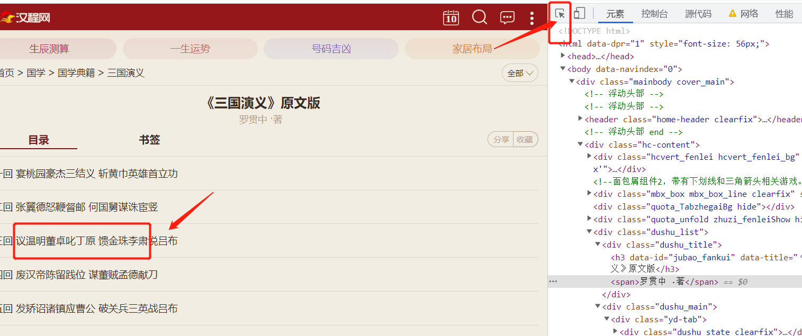
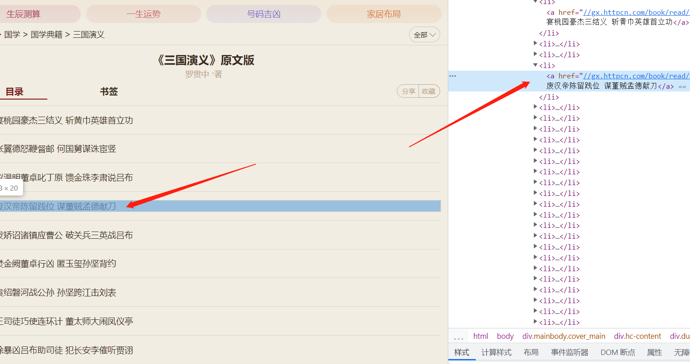
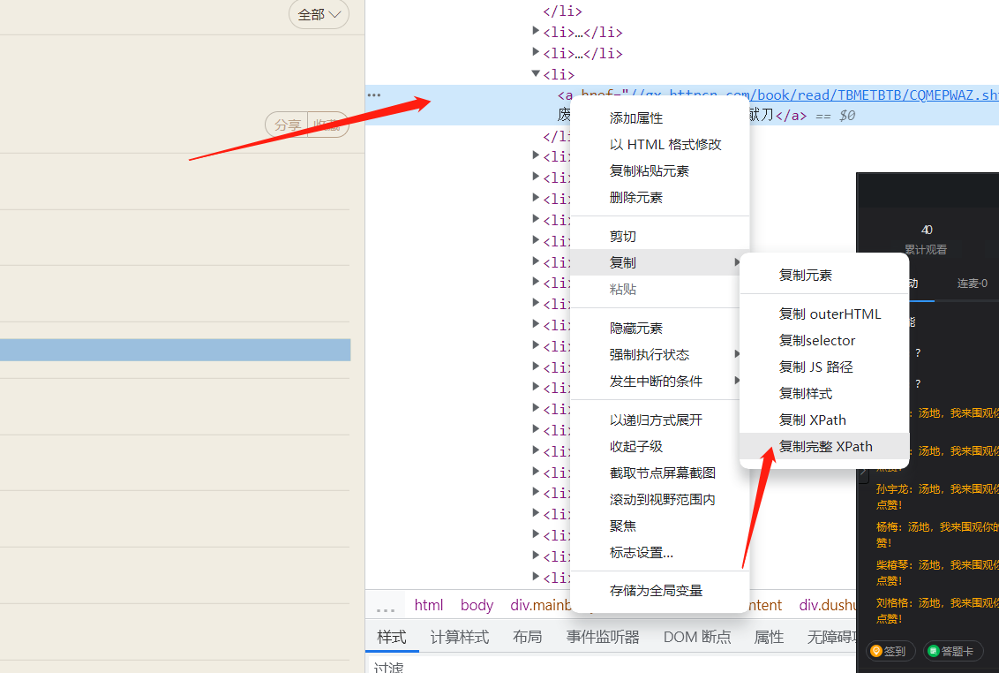

一、爬虫基本结构
----------------


#### 1、引入模块

```python
import requests  
from lxml import etree  # lxml库使用xpath
import time  # 时间模块
import random  # 随机模块
```


#### 2、构造url和头部

```python
url = 'http://gx.httpcn.com/book/sgyy/yuanwen/'

headers = {
    'User-Agent': 'Mozilla/5.0 (Windows NT 10.0; Win64; x64) AppleWebKit/537.36 (KHTML, like Gecko) Chrome/105.0.0.0 Safari/537.36'
}
```


#### 3、构造url参数或data数据

###### 	（根据爬虫情况）请求时把参数或数据携带上


#### 4、构造请求

```python
response = requests.get(url=url, headers=headers)
```


#### 5、检查请求下来相应数据

​	如果状态码是200，而且能够请求下来数据，证明可以爬取。（然后这两行就可以删掉了）

```python
print(response.status_code)
print(response.text)
```


#### 6、解析页面

###### 	1.网页空白位置，右键检查（打开开发者工具），左上角小箭头，然后点击需要的元素



###### 	2.然后开发者工具中，出现对应元素（高亮）



###### 	3.在对应元素上 右键，复制完整的xpath



###### 	4.粘贴xpath路径

```python
html = etree.HTML(response.text)

# a_list = html.xpath('/html/body/div[1]/div/div[5]/div[2]/div/div[2]/div[1]/div/ul/li[8]/a')

# 把li[8]中的[8]删掉 ， 定位到所有li中的a标签

a_list = html.xpath('/html/body/div[1]/div/div[5]/div[2]/div/div[2]/div[1]/div/ul/li/a')
```


#### 7、打印并验证需要采集的数据

```python
# 打印出想要的数据
for a in a_list:
    text = a.xpath('text()')[0]  # 返回值是一个列表，所以取第0个
    href = a.xpath('@href')[0]  # 返回值是一个列表，所以取第0个
    href = 'http:' + href  # href路径不完整，拼接完整
    print(text)  # 能够正常打印出之后，可以删掉
    print(href)  # 能够正常打印出之后，可以删掉
```


#### 8、请求并解析子页面

​	同6，使用开发者工具定位元素位置，并复制完整xpath路径

```python
for a in a_list:
    text = a.xpath('text()')[0]  # 返回值是一个列表，所以取第0个
    href = a.xpath('@href')[0]  # 返回值是一个列表，所以取第0个
    href = 'http:' + href  # href路径不完整，拼接完整
    # print(text)  # 能够正常打印出之后，可以删掉
    # print(href)  # 能够正常打印出之后，可以删掉
	
    # 加入随机数，作为延迟时间，降低行为被识别出的概率
    time.sleep(random.random())
    # 请求内容页(详情页或子页面)
    r = requests.get(url=href, headers=headers)

    # 解析子页面
    r_html = etree.HTML(r.text)
    # p_list = r_html.xpath('/html/body/div[1]/div[2]/div/div/div/div/div[3]/div[1]/p[4]')
    
    # 每段话是一个<p> ， 需要所有<p>标签，所以删掉p[4]中的数字。
    # 同时，直接用xpath路径定位到p标签当中的文本内容，所以跟上 /text()
    p_list = r_html.xpath('/html/body/div[1]/div[2]/div/div/div/div/div[3]/div[1]/p/text()')
```


#### 9、打印子页面内容

```python
	# 打印所有内容
    for p in p_list:
        print(p)
```


#### 10、存储

###### 	1.新建目录——三国演义


###### 	2.生成文件路径，并保存

```python
	# 使用章节名字，生成文件路径
    filepath = '三国演义/' + text + '.txt'
    
    # 新建txt文件，方式w+，编码utf-8
    fp = open(filepath, 'w+', encoding='utf-8')
    
    for p in p_list:
        # 每段话，写入一行
        fp.write(p + '\n')

    fp.close()  # 关闭文件
```


二、完整的源代码
----------------

```python
import requests  
from lxml import etree  # lxml库使用xpath
import time  # 时间模块
import random  # 随机模块

url = 'http://gx.httpcn.com/book/sgyy/yuanwen/'
headers = {
    'User-Agent': 'Mozilla/5.0 (Windows NT 10.0; Win64; x64) AppleWebKit/537.36 (KHTML, like Gecko) Chrome/105.0.0.0 Safari/537.36'
}

response = requests.get(url=url, headers=headers)

# print(response.status_code)
# print(response.text)

html = etree.HTML(response.text)
# a_list = html.xpath('/html/body/div[1]/div/div[5]/div[2]/div/div[2]/div[1]/div/ul/li[8]/a')
# 把li[8]中的[8]删掉 ， 定位到所有li中的a标签
a_list = html.xpath('/html/body/div[1]/div/div[5]/div[2]/div/div[2]/div[1]/div/ul/li/a')

# 打印出想要的数据
for a in a_list:
    text = a.xpath('text()')[0]  # 返回值是一个列表，所以取第0个
    href = a.xpath('@href')[0]  # 返回值是一个列表，所以取第0个
    href = 'http:' + href  # href路径不完整，拼接完整
    # print(text)  # 能够正常打印出之后，可以删掉
    # print(href)  # 能够正常打印出之后，可以删掉

    # 加入随机数，作为延迟时间，降低行为被识别出的概率
    time.sleep(random.random())
    # 请求内容页(详情页或子页面)
    r = requests.get(url=href, headers=headers)

    # 解析子页面
    r_html = etree.HTML(r.text)
    # p_list = r_html.xpath('/html/body/div[1]/div[2]/div/div/div/div/div[3]/div[1]/p[4]')

    # 每段话是一个<p> ， 需要所有<p>标签，所以删掉p[4]中的数字。
    # 同时，直接用xpath路径定位到p标签当中的文本内容，所以跟上 /text()
    p_list = r_html.xpath('/html/body/div[1]/div[2]/div/div/div/div/div[3]/div[1]/p/text()')

    # 使用章节名字，生成文件路径
    filepath = '三国演义/' + text + '.txt'

    # 新建txt文件，方式w+，编码utf-8
    fp = open(filepath, 'w+', encoding='utf-8')

    for p in p_list:
        # 每段话，写入一行
        fp.write(p + '\n')

    fp.close()  # 关闭文件

```