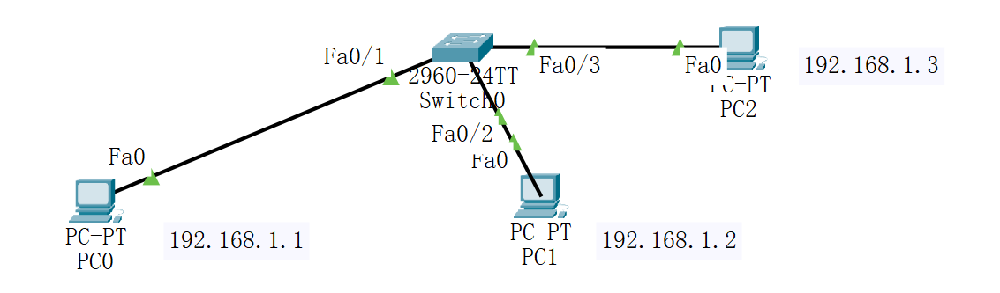
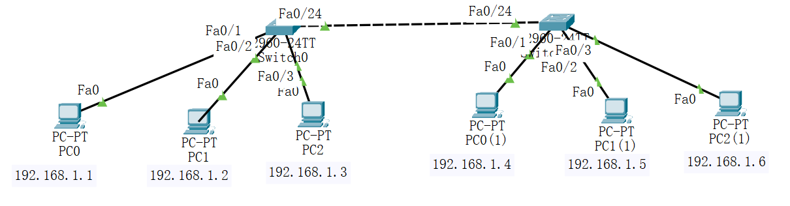

### 用户模式

​	进入交换机，直接进入用户模式，（三角符号）

```
Switch>
Switch>
```

### 特权模式

​	在用户模式下，输入：enable，进入特权模式（#符号）

```
Switch>enable 
Switch#
```

### 全局配置模式

​	在特权模式下，输入：configure terminal，进入全局配置模式（config符号）

​	或者输入简写  conf t

```
Switch#configure terminal
Switch(config)#
```


#### 端口配置模式

​	在全局配置模式下，输入 interface fastEthernet 0/1 ，进入端口1的端口配置模式（config-if 标记）

​	或者输入简写  int f0/1

```
Switch(config)#interface fastEthernet 0/1
Switch(config-if)#
```


#### 访问配置模式

​	在全局配置模式下，输入line vty 0 ，进入访问配置模式（config-line 标记）

```
Switch(config)#line vty 0
Switch(config-line)#
```


#### 配置VLAN

​	全局配置模式下

```
Switch(config)#vlan 10
Switch(config-vlan)#name canting
Switch(config-vlan)#exit
Switch(config)#vlan 20 
Switch(config-vlan)#name sushe
Switch(config-vlan)#exit
```


#### 端口配置VLAN

​	全局配置模式下

```python
Switch(config)#int f0/1      #进入端口1
Switch(config-if)#switchport mode access      #配置端口模式为access
Switch(config-if)#switchport access vlan 10   #配置端口vlan为vlan 10
Switch(config-if)#exit    #退出
```


```python
Switch(config)#interface range fastEthernet 0/2-3      #进入端口2-3
Switch(config-if-range)#switchport mode access      #配置端口模式为access
Switch(config-if-range)#switchport access vlan 20   #配置端口vlan为vlan 20
Switch(config-if-range)#exit    #退出
```





#### 双交换机配置VLAN

​	左右两边交换机，均需要配置

```python
Switch(config)#interface fastEthernet 0/24
Switch(config-if)#switchport mode trunk 
```





