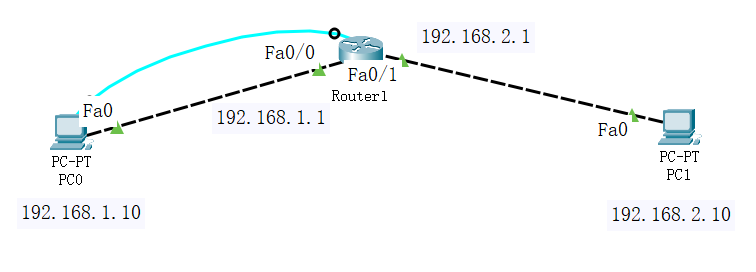
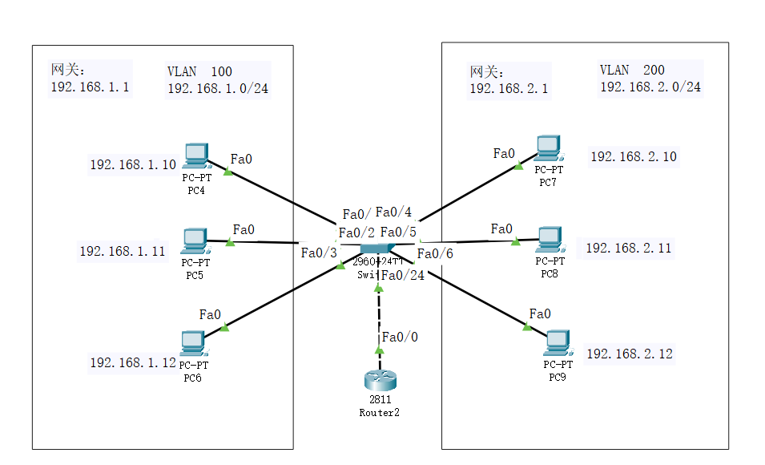

任务1-1
-------

### 	路由器的基本配置

​	#拓扑图



```python
Router>enable 
Router#configure t
Router(config)#hostname R0
R0(config)#
```

```python
R0(config)#interface fastEthernet 0/0
R0(config-if)#ip address 192.168.1.1 255.255.255.0
R0(config-if)#no shutdown
R0(config-if)#exit
```

```python
R0(config)#interface fastEthernet 0/1
R0(config-if)#ip address 192.168.2.1 255.255.255.0
R0(config-if)#no shutdown
R0(config-if)#exit
```


任务1-2
-------

### 	VLAN间通信

​	#拓扑图



​	PC配置

| IP地址           | 子网掩码          | 网关            |
| ---------------- | ----------------- | --------------- |
| *192.168.1.10*   | *255.255.255.0*   | *192.168.1.1*   |
| *192.168.1.11*   | *255.255.255.0*   | *192.168.1.1*   |
| *192.168.1.12*   | *255.255.255.0*   | *192.168.1.1*   |
| **192.168.2.10** | **255.255.255.0** | **192.168.2.1** |
| **192.168.2.11** | **255.255.255.0** | **192.168.2.1** |
| **192.168.2.12** | **255.255.255.0** | **192.168.2.1** |


#### 交换机配置

```python
#创建两个VLAN ——  jiaoshi : vlan 100    和    sushe:  vlan 200

Switch>enable 
Switch#conf t
Switch(config)#vlan 100
Switch(config-vlan)#name jiaoshi
Switch(config-vlan)#exit
Switch(config)#vlan 200
Switch(config-vlan)#name sushe
Switch(config-vlan)#exit
```

```python
#给1-3口配置为access类型端口，并分配给vlan 100
Switch(config)#interface range fastEthernet 0/1-3
Switch(config-if-range)#switchport mode access
Switch(config-if-range)#switchport access vlan 100
Switch(config-if-range)#exit

#给4-6口配置为access类型端口，并分配给vlan 200
Switch(config)#interface range fastEthernet 0/4-6
Switch(config-if-range)#switchport mode access
Switch(config-if-range)#switchport access vlan 200
Switch(config-if-range)#exit
```

```python
#给24口配置为trunk类型端口（可以通过所有vlan）

Switch(config)#interface fastEthernet 0/24
Switch(config-if)#switchport mode trunk
Switch(config-if)#no shutdown
Switch(config-if)#exit
```


#### 路由器配置

```python
#开启路由器 0/0 口
Router>enable 
Router#conf t
Router(config)#interface fastEthernet 0/0
Router(config-if)#no shutdown 
```

```python
#进入子接口0/0.100 , 启动802.1Q trunk封装协议，并配置IP
Router(config)#interface fastEthernet 0/0.100
Router(config-subif)#encapsulation dot1Q 100
Router(config-subif)#ip address 192.168.1.1 255.255.255.0
Router(config-subif)#exit

#进入子接口0/0.200 , 启动802.1Q trunk封装协议，并配置IP
Router(config)#interface fastEthernet 0/0.200
Router(config-subif)#encapsulation dot1Q 200
Router(config-subif)#ip address 192.168.2.1 255.255.255.0
Router(config-subif)#exit
```

