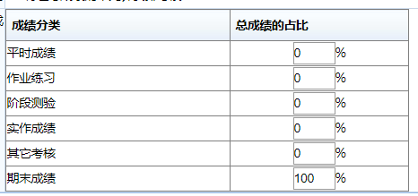

进度
====

```
1.->课程成绩构成设置->2.生成试卷->3.设置阅卷老师->4.发布试卷->5.排考（目前完全由教务处操作）->6.学生考试、交卷->7.阅卷老师批改->8.查询成绩->9.导入平时成绩->10.打印试卷分析报告、成绩单
我操作1-7步可以正常进行。
```

```
登录网址：http://ks.lkyedu.com/Loginb.aspx

学生登录
账号：身份证号（大写X）    密码：000000

教师登录
账号：工号    密码：000000
```

复制粘贴功能：
==============

需要讨论哪种方式实现：

```
1. 复制粘贴功能没有单独开启功能，一旦开启全校都开启。（教务处不建议）
2. 题目可以上传文件（少个按钮，已反馈给试题库技术员，正在开发，大约这一两天上线；缺点：不方便阅卷老师改卷）
3. 学生网页可以切屏，代码在IDE写完后，再手敲一遍到文本框（方便阅卷）
```

资料准备
========

```
如果使用试题库进行考试
《试卷》、《参考答案》、《评分标准》、《命题审批表》（！可能！）不再需要准备

1.因为试卷随机生成
2.试题库带有答案
3.试题库中设置得分点（即评分标准）
4.试题库资料中有《考试命题质量审核表》
```

成绩构成
========



成绩分类无法修改，可以修改成绩占比（需要讨论）

资料打印
========

1. 以上成绩可以导入试题库，和期末成绩共同构成期末成绩
2. 阅卷老师给完成绩，无法返回，无法查看（只有一次机会）
3. 学院管理员账户：试题库可以生成并打印《成绩单》《成绩分析》
4. 任课教师账户：暂时无法查看和打印《成绩单》《成绩分析》（5.30已反馈教务处）
5. 问题：试题库中 课程-任课教师对应关系不正确（学院无权限修改），任课老师无法看到成绩、上传平时成绩、打印资料（已反馈，教务处：排完考后，她现场给我们修改）

